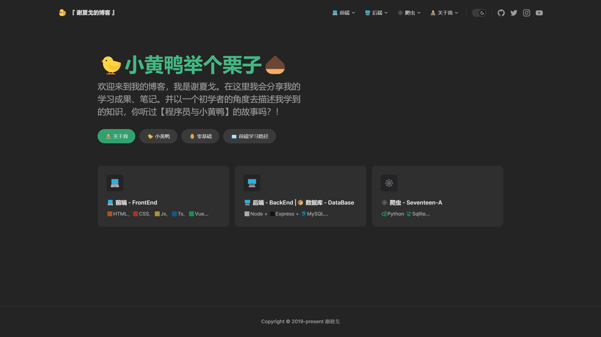

# 🐤小黄鸭举个栗子🌰

这是一个新的博客，之前那个太花里胡哨了。想重新出发，做好这个博客！

我受到[【TypeScript入门教程】](https://ts.xcatliu.com/)的启发,希望我的博客能把一些知识用简单的话说出来。

这类似一种【费曼学习法】，把学到的知识叙述出来，让初学者也能理解，并且更好懂！

所以名字就用了【🐤小黄鸭举个栗子🌰】

## 更新进度
1. 目前还在整理笔记中....

  

