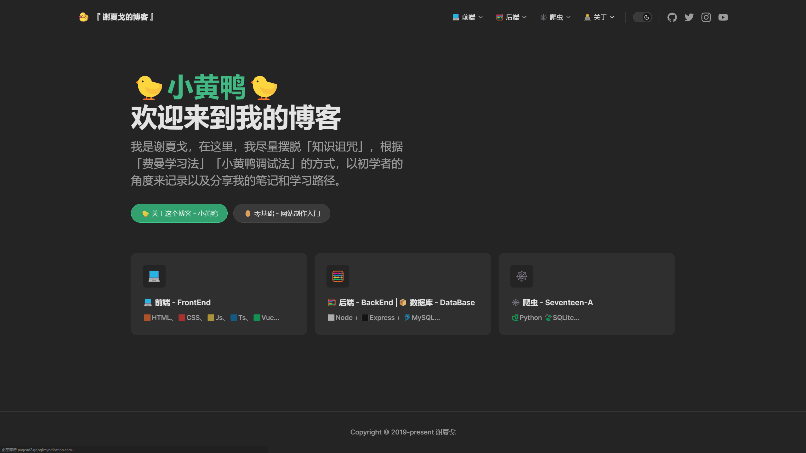

# 🐤小黄鸭🐤

  

这是一个新的博客，旧的太花里胡哨了。  

我受到[【TypeScript入门教程】](https://ts.xcatliu.com/)的启发,希望我的博客能把知识用简单的话说出来。

就像【费曼学习法】，把学到的知识叙述出来，既能了解自己是否掌握，也可以给其他人看！

🐤小黄鸭 这个名字来源于一个故事：【[小黄鸭调试法](https://baike.baidu.com/item/%E5%B0%8F%E9%BB%84%E9%B8%AD%E8%B0%83%E8%AF%95%E6%B3%95/16569594)】

## 更新进度
1. 目前还在整理笔记中....

  
