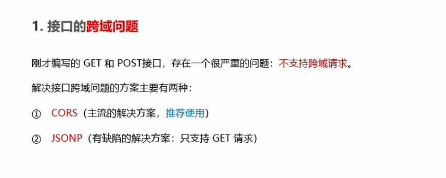
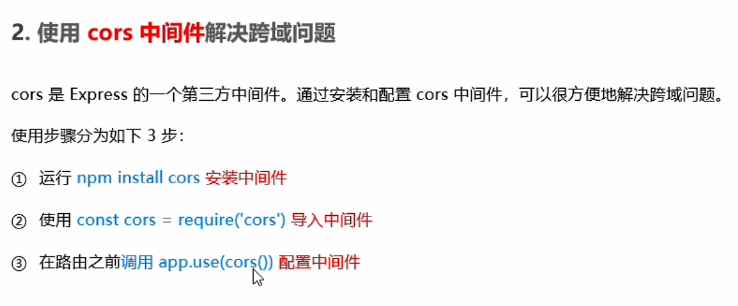

# ⬛ Express - CORS跨域

## 方法一：CORS
  

  


```shell
npm install cors
```
```javascript
const cors = require('cors')
```
```javascript
app.use(cors())
```

## 方法二：手动配置
```javascript
app.all('*', function(req, res, next) {
    res.header("Access-Control-Allow-Origin", req.headers.origin);
    res.header("Access-Control-Allow-Headers", "*");
    res.header("Access-Control-Allow-Methods", "*");
    res.header("X-Powered-By",' 3.2.1');
    res.header("Content-Type", "application/json;charset=utf-8");
    next();
});

//或者
var allowCors = function (req, res, next) {
    if (req.headers.origin == 'http://localhost:3000' || req.headers.origin == 'https://emxz.top') {
        res.header('Access-Control-Allow-Origin', req.headers.origin);
        res.header('Access-Control-Allow-Methods', 'GET,PUT,POST,DELETE,OPTIONS');
        res.header('Access-Control-Allow-Headers', 'Content-Type');
        res.header('Access-Control-Allow-Credentials', 'true');
        next();
    }
};
app.use(allowCors); //使用跨域中间件
```

