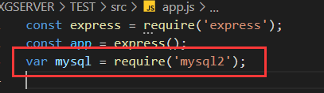
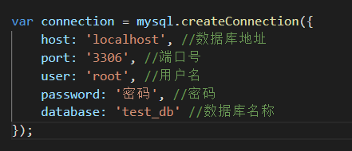
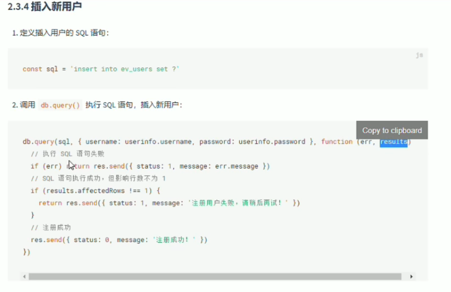

# ⬛ Express + 🐬 MySQL

**在连接【本地数据库】时，先确保【本地数据库】服务开启了~**
**并且有对应的数据库与数据表**
## 安装mysql2
```shell
npm install mysql2
```
## 引入mysql2 与 连接
  
  

```javascript
const mysql = require('mysql2')

const db = mysql.createConnection({
    host: 'localhost',
    port: '3306',
    user: 'root',
    password: '密码',
    database: 'my_db01'
})
db.connect();
```

1. 下载数据库MySQL2(一定要下载2）
2. 引入数据库，并且用最原始的方法连接
3. 连接指令
4. 写接口 调用SQL语句，并执行
5. **调用完后关闭**！
6. 放出接口监听服务！！
```javascript
//1、引入库
const express = require('express');
const app = express();
var mysql = require('mysql2');

//2、连接数据库（MySQL要下载好并且在本地启动好服务）
var db = mysql.createConnection({
    host: 'localhost', //数据库地址
    port: '3306', //端口号
    user: 'root', //用户名
    password: '密码', //密码
    database: 'test_db' //数据库名称
});

//3、连接指令
db.connect();

//4、写SQL指令 并且用原始的命令执行
var sql = 'SELECT * FROM biao';
var str = '';
db.query(sql, function(err, result) {
    if (err) {
        console.log('[SELECT ERROR]：', err.message);
    }
    str = result;
    console.log(result);
});

db.end();//数据库访问完要记得关闭

//这里可以设置跨域


//5、等待前端的请求，然后返回对应的数据👇（这里需要用到Express的知识）
app.get('/Movie', (req, res) => {
    res.json({
        str
    })
})

//6、接口3010 启动服务
app.listen(3010, () => {
    console.log("server 启动成功！")
})

```
# 执行命令👇
```javascript
  db.query('mysql查询字符串',function(err,results,fields) {
        //执行操作
    });
```

1. 在查找过程中，如果出错返回的Error
1. results包含查找的结果
1. fields包含返回结果的字段信息
## 插入数据👇
```javascript
const user = { username:'xxgg', password:'12345678' }

const sql = 'INSERT INTO users (username,password) VALUES (? , ?)'
connection.query(sql,[user.username,user.password],(err,res)=>{
  if(err) return console.log(err,message)//失败
  if(res.affectedRows === 1){console.log('插入成功')
}
  
```
如果【数据对象的每个属性】和【数据表的字段】一一对应，可以快速插入数据👇
```javascript
const user = { username:'xxgg', password:'12345678' }

const sql = 'INSERT INTO users SET ?'
connection.query(sql,user,(err,res)=>{
  if(err) return console.log(err,message)//失败
  if(res.affectedRows === 1){console.log('插入成功')
}
```
  

## 更新数据👇
```javascript
const user = {id:7 username:'aaa', password:'000' }

const sql = 'UPDATE users SET username=? password=? WHERE id=?'
connection.query(sql,[user.username,user.password,user.id],(err,res)=>{
  if(err) return console.log(err,message)//失败
  if(res.affectedRows === 1){console.log('更新数据成功')
}
```
```javascript
const user = {id:7 username:'aaa', password:'000' }

const sql = 'UPDATE users SET ? WHERE id=?'
connection.query(sql,[user,user.id],(err,res)=>{
  if(err) return console.log(err,message)//失败
  if(res.affectedRows === 1){console.log('更新数据成功')
}
```
## 删除数据👇
```javascript
const id = 7

const sql = 'DELETE FROM users WHERE id=?'
connection.query(sql,id,(err,res)=>{
  if(err) return console.log(err,message)//失败
  if(res.affectedRows === 1){console.log('删除数据成功')
}
```
### 标记删除
使用DELETE语句，会真正的把数据从表中删除掉，为了保险起见，推荐使用【标记删除】的形式，来模拟删除的动作，
所谓【标记删除】就是用一个【字段】标记这条数据已经被删除。但是实际上不用真的删除这条数据


