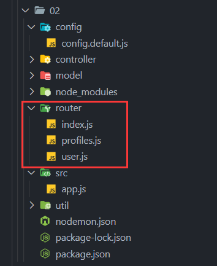
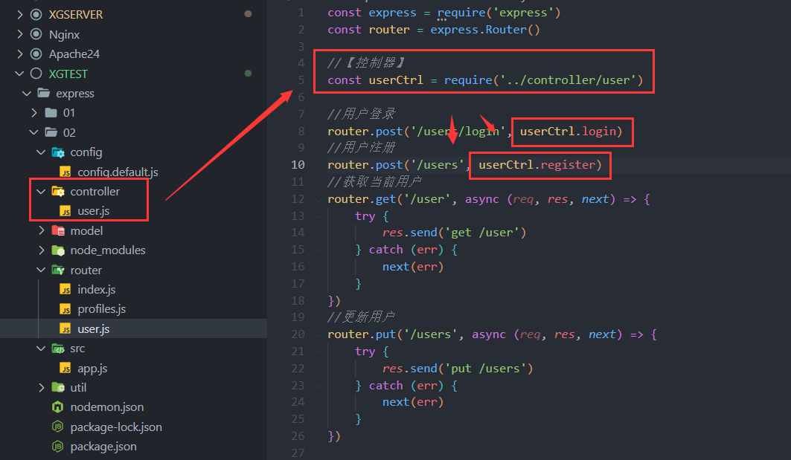
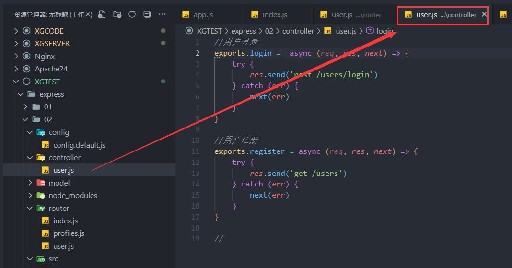
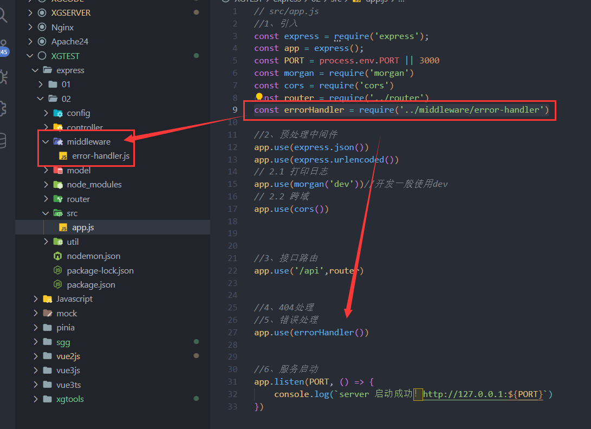

# ⬛Express+⬜Node+🐬MySQL

## 1、创建项目
```shell
npm init -y
npm i express
npm i nodemon -D
npm i mysql2
npm i jsonwebtoken
npm i express-jwt
```
根目录添加nodemon.json
```json
{
  "watch":["./src/**/*.*"]
}
```
```json
//package.json
"scripts": {
  "dev": "nodemon src/app",
},
```
### 根目录创建app.js
```javascript
const express = require('express');
const app = express();
```
### 创建路由文件夹
router/index.js
```javascript
//index.js
const express = require('express')
const router = express.Router()
const mysql = require('mysql2')
const jwt = require('jsonwebtoken');
const { expressjwt: expressJWT } = require('express-jwt');

//创建数据库【连接】/【关闭】

//用户注册
router.post('/register', (req, res, next) => {
    try {
        res.send('post /users/login')
    } catch (err) {
        next(err)
    }
})

//用户登录
router.post('/login', (req, res, next) => {
    try {
        res.send('post /users/login')
    } catch (err) {
        next(err)
    }
})

//获取todolist
//更新todolist

//获取MarkBook
//更新MarkBook

module.exports = router
```
## 2、目录结构
创建config/config.default.js【配置文件】
```javascript
/**
* 默认配置
*/

module.exports={}							
```
controller 【解析用户的输入，处理后反应相应的结果】【控制器】
model【数据持久层】
middleware【非路由的中间件】
router【路由】
util【工具模块】
app.js【启动文件】
## 3、配置常用中间件
### 请求中间件

- express.json()
- express.urlencoded()
```javascript
app.use(express.json())
app.use(express.urlencoded())
```
### 日志输出

- morgan()【第三方 需要安装】【放在预处理处】
- npm i morgan
```javascript
app.use(morgan('dev'))//开发一般使用dev
```
### 为客户端提供跨域资源请求

- cors()【也需要安装】【放在预处理处】
```shell
npm i cors
```
```javascript
app.use(cors())
```
## 4、路由模块👇
  

把其他模块挂载在index.js 主路由中！
```javascript
//index.js
const express = require('express')
const router = express.Router()

//用户相关路由
router.use(require('./user'))

//文章相关路由
router.use(require('./profiles'))

module.exports = router
```
```javascript
//user.js
const express = require('express')
const router = express.Router()

//用户登录
router.post('/users/login', async (req, res, next) => {
    try {
        res.send('post /users/login')
    } catch (err) {
        next(err)
    }
})

//...

module.exports = router
```
## 5、controller【控制器】
一般来说 在router控制接口的路由，而对应的接口有对应的功能，但是如果功能需要写很多代码，全部功能都挤在一个路由文件里就不是很好维护！
所以在路由文件里就只理路由，把路由到后需要处理的方法再单独放到另一个文件夹【controller】里
  
  


```javascript
//用户登录
exports.login =  async (req, res, next) => {
    try {
        res.send('post /users/login')
    } catch (err) {
        next(err)
    }
}

//用户注册
exports.register = async (req, res, next) => {
    try {
        res.send('get /users')
    } catch (err) {
        next(err)
    }
}
```
## 6、错误处理👇
```javascript
//5、错误处理
const errorHandler = require('../middleware/error-handler')

app.use(errorHandler())
```
  

```javascript
module.exports = () =>{
	return (err, req, res, next) => {
		//token解析失败导致的错误
		if (err.name === 'UnauthorizedError') {
			return res.send({ status: 401, message: '无效的token' })
		}
		
		//其他原因导致的错误
		res.send({ status: 500, message: '未知错误' })
	}
}
```
## 数据库连接👇

1. 数据库连接
1. 连接失败
1. 连接成功
1. 创建一个模型
