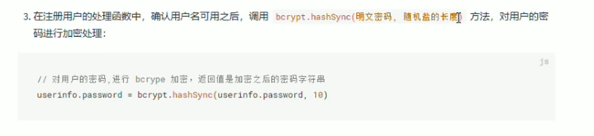
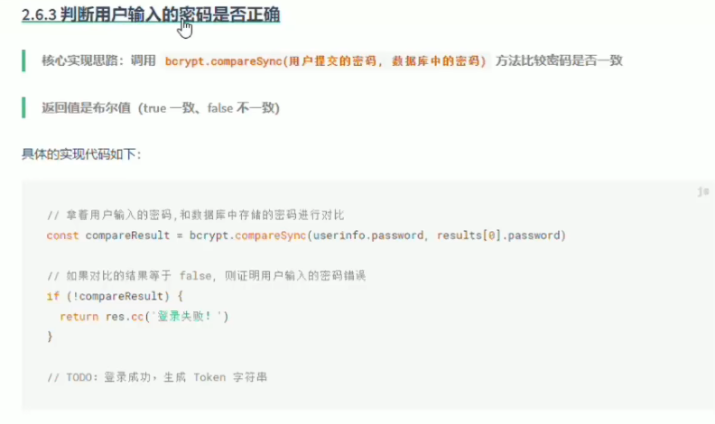

# 🔒 密码加密 bcryptjs

## bcryptjs包进行加密
  

```shell
npm i bcryptjs
```
```javascript
const bcrypt = require('bcryptjs')
```
  

### bcrypt.hashSync()
```javascript
let password = bcrypt.hashSync(req.body.password,10)
```
## 密码解密
  

```javascript
bcrypt.compareSync()
```

