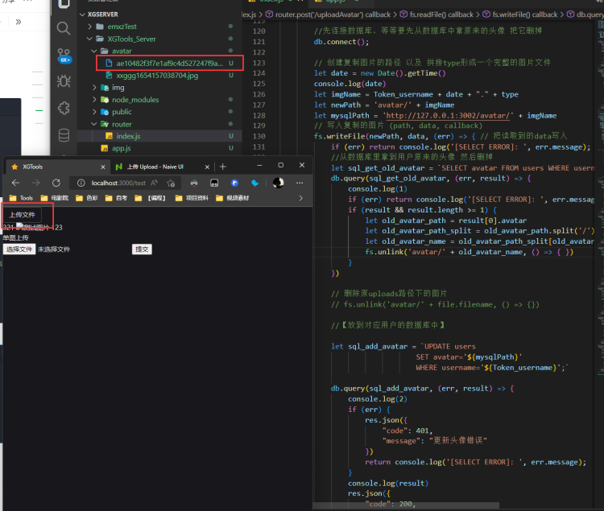

# 🤵 multer 上传头像

## 上传【图片】（头像还需要前端裁剪）
1. 【安装并导入】在express中安装multer【上传文件】的中间件
1. 【配置存放文件夹】在路由前配置 上传的文件位置
1. 【请求配置】在请求处添加【单文件上传】【以及前端对应的name或form-data的key属性】
1. 【前端配置】

这时候 其实文件就以及上传成功了，但是文件会以二进制【源】的形式保存着。

4. 【重新写入】去读取这个【源文件】并且根据【源】重新写出一个【图片文件 - xxx.png】放回到原来的地方
4. 【保存到数据库】然后把这个文件存入对应用户的MySQL表里！【记得取好名字！】
4. 【善后~】最后把【源文件】删除掉，同时可以把【保存在数据库里的图片路径】返回给前端。
4. 【express打开静态资源管理】
## 安装multer
```javascript
//1.安装 
npm install multer
// 引入
const multer = require('multer')//文件上传
const fs = require('fs')
//【记得引入数据库和jwt解析 这部分内容在其他文章】
```
## 配置
### 后端node.js + express + multur
其实到了这一步 就以及可以取得前端传来的图片了👇
```javascript
//2.在路由前配置 上传的文件位置
let uploadImg = multer({ dest: 'avatar/' })

//3.在请求处添加【单文件上传】【以及前端对应的name或form-data的key属性】
router.post('/uploadAvatar', uploadImg.single('avatar'), (req, res) => {
  console.log(req.file)
}  
```
### 前端：
```html
<form action="http://127.0.0.1:3002/uploadAvatar" method="post" enctype="multipart/form-data">
  <h3>单图上传</h3>
  <input type="file" name="avatar">
  <input type="submit" value="提交">
</form>
```
下面是使用Naive-UI组件
```html
<n-upload :show-file-list="false" 
          action="http://127.0.0.1:3002/uploadAvatar" 
          @finish="handleFinish" 
          type="file"
          name="avatar" 
          :headers="{
                'authorization': Token
          }">
            <n-button>上传文件</n-button>
</n-upload>
```
  

但是这时候图片还是【源】，没有后缀，打不开。
于是需要对图片进行【简单拼接】，并且保存进用户数据库，而保存进数据库需要用户的Token！
以下是完整的代码 
## 完整后端express + multer
```javascript
//1. 引入
//index.js
const express = require('express')
const router = express.Router()
const mysql = require('mysql2')
const jwt = require('jsonwebtoken'); //jwt加密
const { expressjwt: expressJWT } = require('express-jwt'); //解析jwt
const bcrypt = require('bcryptjs') //密码加密
const multer = require('multer')//文件上传
const fs = require('fs')


//这里是其他的代码，包括【注册】【登录】【登录发送Token给前端】
let secretKey = '这是在发送给前端Token所需要加入的【密码加盐】'
//.......【各种代码】


//2.在路由前配置 上传的文件位置
let uploadImg = multer({ dest: 'avatar/' })

// 这里的【uploadImg】就是上文的multer的配置对象
// 这里的【single】中的字符串要对应上传input的name 或者是对应formdata的键名  【expressJWT是用于解析jwt的】
router.post('/uploadAvatar', uploadImg.single('avatar'), expressJWT({ secret: secretKey, algorithms: ['HS256'] }), (req, res) => {
  
    //通过上面两个参数，可以让我们的req这个请求多出两个属性，一个是【file】对应上传的文件，一个是【req.auth】是Token
    let file = req.file
    let Token_username = req.auth.username

    // 【图片文件的保存操作将在下面写出】
    let originalArr = file.originalname.split('.') //分割[xx.png]
    let type = originalArr[originalArr.length - 1]// 拿到png
    // 读取文件 ( path, 'utf-8'(这里不写解码类型,直接把回调函数中的data写入新文件即可), callback)
    fs.readFile(file.path, (err, data) => {
        if (err) return console.log('[SELECT ERROR]: ', err.message);

        //先连接数据库，等等要先从数据库中拿原来的头像 把【原来的头像】删掉
        db.connect();

        // 创建复制图片的路径 以及 拼接type形成一个完整的图片文件
        let date = new Date().getTime()
        let imgName = Token_username + date + "." + type//【这是图片名称】
        let newPath = 'avatar/' + imgName	//【这是本地图片路径】
        let mysqlPath = 'http://127.0.0.1:3002/avatar/' + imgName //【这是保存在数据库里的图片路径】
        
        
        // 写入复制的图片 (path, data, callback)
        fs.writeFile(newPath, data, (err) => { // 把读取到的data写入
            if (err) return console.log('[SELECT ERROR]: ', err.message);
          
            //从数据库里拿到用户原来的头像 然后删掉
            let sql_get_old_avatar = `SELECT avatar FROM users WHERE username='${Token_username}'`
            db.query(sql_get_old_avatar, (err, result) => {
                if (err) return console.log('[SELECT ERROR]: ', err.message);
                if (result && result.length >= 1) {
                    let old_avatar_path = result[0].avatar
                    let old_avatar_path_split = old_avatar_path.split('/')
                    let old_avatar_name = old_avatar_path_split[old_avatar_path_split.length - 1]
                    fs.unlink('avatar/' + old_avatar_name, () => { })
                }
            })

            // 删除原uploads路径下的图片
            fs.unlink('avatar/' + file.filename, () => {})

            //【放到对应用户的数据库中】
            let sql_add_avatar = `UPDATE users 
                                SET avatar='${mysqlPath}' 
                                WHERE username='${Token_username}';`

            db.query(sql_add_avatar, (err, result) => {
                if (err) {
                    res.json({
                        "code": 401,
                        "message": "更新头像错误"
                    })
                    return console.log('[SELECT ERROR]: ', err.message);
                }
                res.json({
                    "code": 200,
                    "message": "头像更新成功",
                    "data": result,
                    "imgUrl":mysqlPath
                })
            })
        })
    })
})
```
## 前端上传【头像】（需要裁剪、正方形）

1. 【裁切】对图片进行裁剪【使用vue-cropper】【或者Cropper.js✅】
1. 对上传文件请求头里添加Token！

### 安装cropperjs（1.5版本）
官方gihub文档：[https://github.com/fengyuanchen/cropperjs/blob/main/README.md](https://github.com/fengyuanchen/cropperjs/blob/main/README.md)
```shell
npm install cropperjs
```
### 引入👇
```shell
import 'cropperjs/dist/cropper.css';
import Cropper from 'cropperjs';
```
```html
<!-- 1.一个用于获取上传文件的input，type="file"，并且监听onchange事件  -->
<input type="file" id="imgReader" @change="loadingImg($event)">

<!-- 2.一个用于给Cropper.js覆盖使用的img  -->


<!-- 3.两个用于预览的div  -->
<div class="previewBox"></div>
<button @click="GetData">上传文件</button>
```
```javascript
let CROPPER: any = null    //创建一个cropper的全局对象 
const loadingImg = (eve: any) => {
  //解决再次上传图片 没换到图片的问题
    if (CROPPER) {
        CROPPER.destroy()
    }
    let reader = new FileReader();
    console.log(eve.target.files)
    if (eve.target.files[0]) {

        //readAsDataURL方法可以将File对象转化为data:URL格式的字符串（base64编码）
        reader.readAsDataURL(eve.target.files[0]);
        reader.onload = (e) => {
            let dataURL = reader.result;
            document.getElementById('cropImg').src = dataURL
            //将img的src改为刚上传的文件的转换格式
            const image: any = document.getElementById('cropImg');

            //创建cropper实例-----------------------------------------
            CROPPER = new Cropper(image, {
                aspectRatio: 1,
                viewMode: 1,
                minContainerWidth: 240,
                minContainerHeight: 240,
                dragMode: 'move',
                preview: [document.querySelector('.previewBox')]
            })
        }
    }
}

const GetData = () => {
    //getCroppedCanvas方法可以将裁剪区域的数据转换成canvas数据
    CROPPER.getCroppedCanvas({
        width: 240,
        height: 240,
        minWidth:200,
        minHeight:200,
        maxWidth:240,
        maxHeight:240,
        fillColor: '#fff',
        imageSmoothingEnabled: true,
        imageSmoothingQuality: 'high',
    }).toBlob((blob: any) => {
        //然后调用浏览器原生的toBlob方法将canvas数据转换成blob数据
        //之后就可以愉快的将blob数据发送至后端啦，可根据自己情况进行发送，我这里用的是axios
        let formData = new FormData();
        // 第三个参数为文件名，可选填.
        formData.append('avatar', blob,'avatar.png');

        let data = uploadAvatar(formData)
    })
}
```
