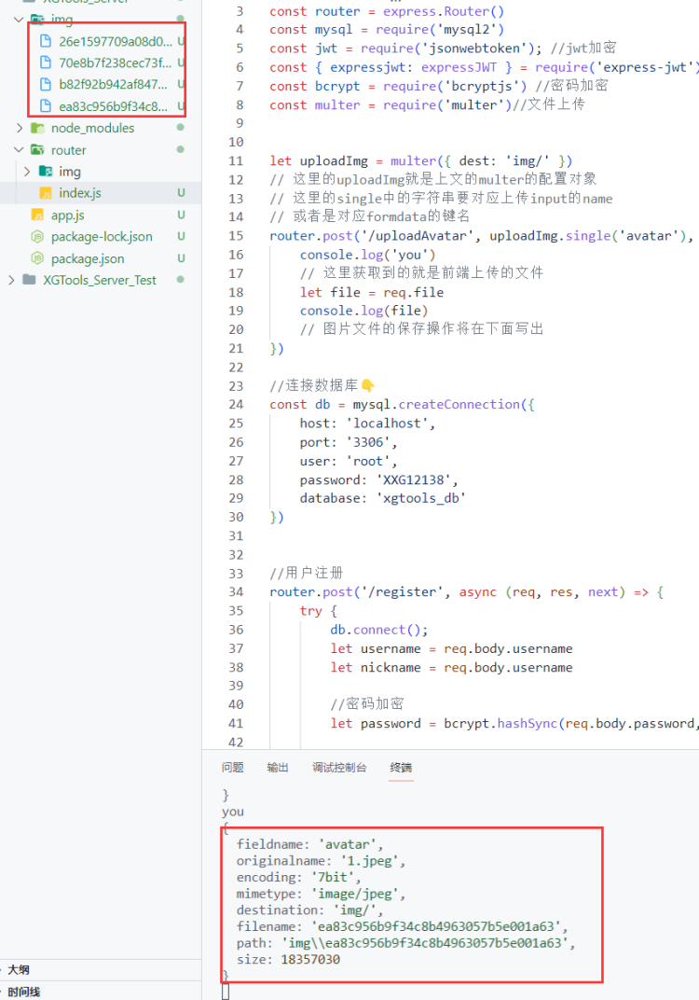

# 🗂️ multer 上传文件 

## 一、multer是什么？
multer是一个能更好的处理node.js服务器接收的文件上传的中间件，蛮好用的。其中文文档链接如下：
> multer中文文档：[https://github.com/expressjs/multer/blob/master/doc/README-zh-cn.md](https://github.com/expressjs/multer/blob/master/doc/README-zh-cn.md)

```shell
npm i multer
```
这里是最简单的配置，指明二进制文件保存保存至【根目录下的uploads文件夹】内
```javascript
var multer = require('multer')

var upload = multer({ dest: 'uploads/' })
```
## 单图上传

1. upload就是上文的multer的配置对象
1. single中的字符串要对应上传input的name 或者是对应formdata的键名
```javascript
router.post('/uploadAvatar', upload.single('avatar'), (req, res) => {
    let file = req.file
    // 图片文件的保存操作将在下面写出
})
```
## 保存图片👇
  

### 图片打不开,要拼接保存路径！👇
```javascript
const multer = require('multer')//文件上传
const fs = require('fs')

let uploadImg = multer({ dest: 'img/' })
router.post('/uploadAvatar', uploadImg.single('avatar'), (req, res) => {
    let file = req.file
    console.log(file)
		//【保存图片到文件夹】
    let originalArr = file.originalname.split('.') //分割[xx.png]
    let type = originalArr[originalArr.length - 1]//png 或者jpg
    // 读取文件 ( path, 'utf-8'(这里不写解码类型,直接把回调函数中的data写入新文件即可), callback)
    fs.readFile(file.path, (err, data) => {
        if (err) throw err

        // 创建复制图片的路径 以及 拼接type形成一个完整的图片文件
        let newPath = 'img/' + file.filename + "." + type

        // 写入复制的图片 (path, data, callback)
        fs.writeFile( newPath, data, (error) => { // 把读取到的data写入
            if (error) throw error
        })
        // 删除原uploads路径下的图片
        fs.unlink('img/' + file.filename, () => {
            
        })
    })
})
```

## 补充：确保一个用户只会保存一张头像
根据前面的想法，每次用户上传就将头像路径和id绑定，同一用户再次上传时就先根据前一次绑定的头像路径将该图片删除，再将新头像路径绑定到对应id。以此反复，保证服务器上每个用户只会保存一张头像图片。
```javascript
// 给 头像图片取名字！

```
