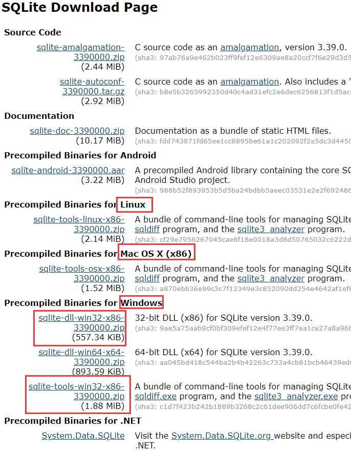
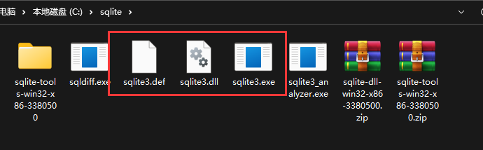
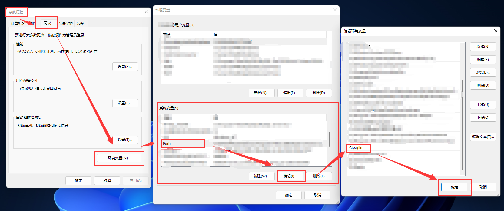
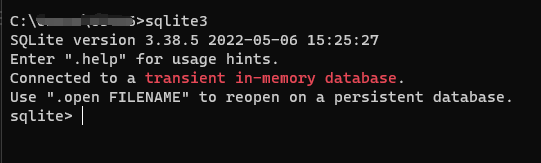

# 🍃 SQLite

::: tip Python & SQLite
Python中内置sqlite3，无需安装，引入就可以调用！  
我们可以到时候把爬虫的数据保存进这个数据库！
:::
SQLite是一个软件库，实现了自给自足的、无服务器的、零配置的、事务性的 SQL 数据库引擎。

## 🍃 安装

> 官方下载地址：[https://www.sqlite.org/download.html](https://www.sqlite.org/download.html)

1. 您需要下载 `sqlite-tools-win32-*.zip` 和 `sqlite-dll-win32-*.zip` 压缩文件。

  

2. 创建文件夹 C:\sqlite,并在此文件夹下解压将得到 `sqlite3.def`、`sqlite3.dll` 和 `sqlite3.exe` 文件。
  

3. 添加 C:\sqlite 到 PATH 环境变量
  
  

:::info
右键“在新标签打开图像可以看到大图”
:::
4. 最后在命令提示符下，使用 sqlite3 命令，将显示如下结果。

  
 
