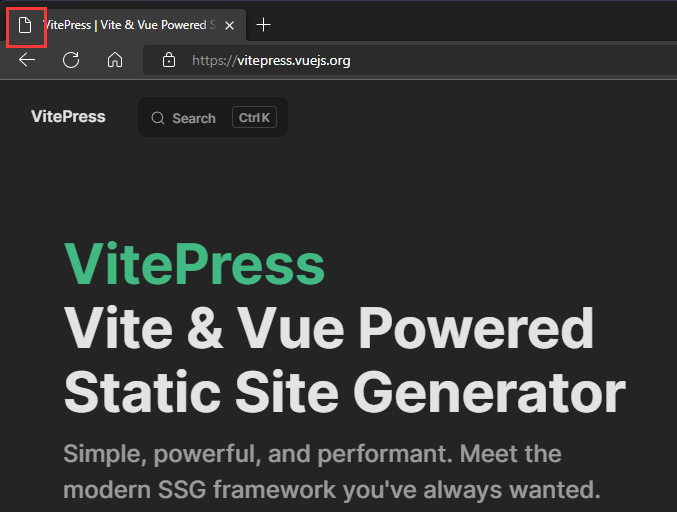
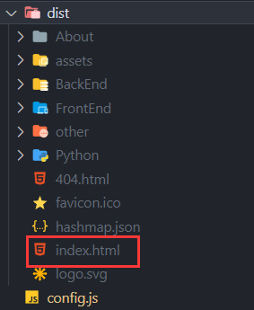
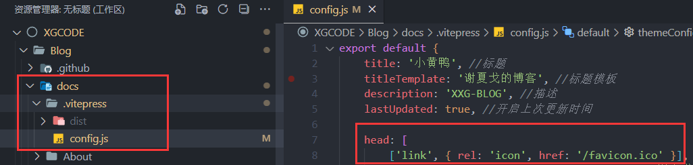
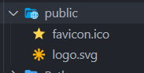
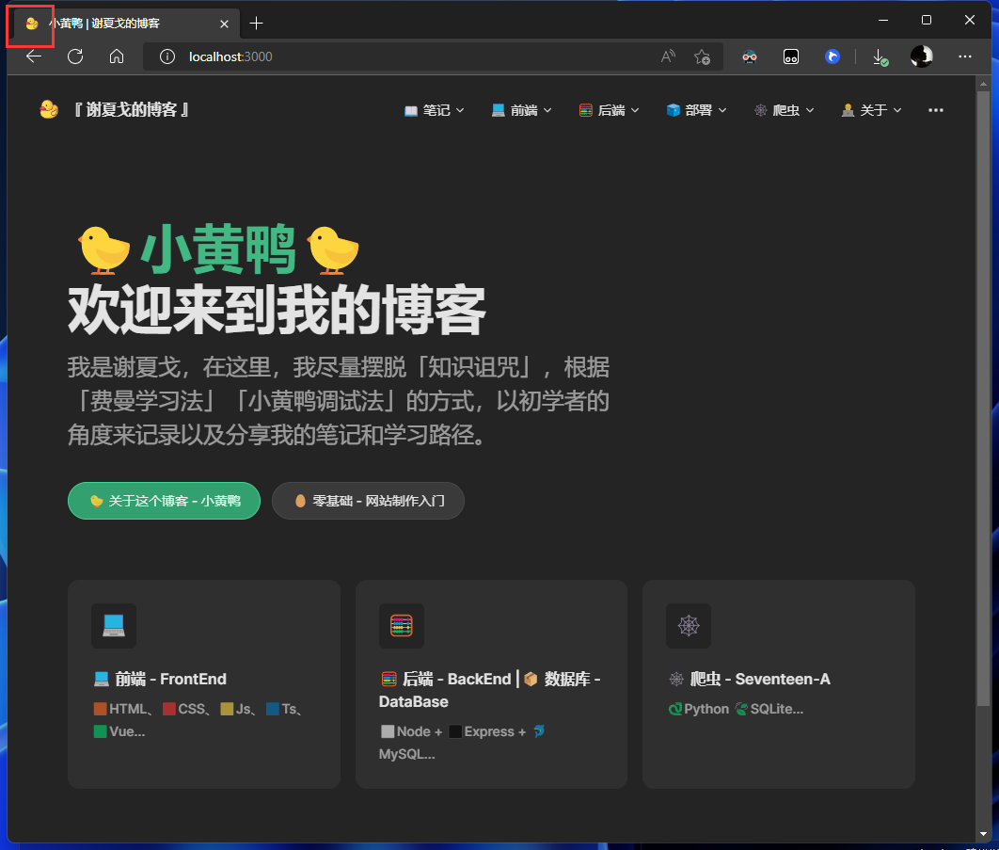

# 🌩️ VitePress 标签页图标设置


最近用 [VitePress](https://vitepress.vuejs.org/) 搭建博客  
但是标签页没有图标...   
官方文档也没有写在哪里设置...  
连官方都没有图标..（当前：2022年7月1日）
  

---

一般网页的标签页图标都是放在默认`index.html`文件里的👇
```html
<head>
    <link rel="icon" href="/favicon.ico" />
</head>
```

但是写VitePress博客、VuePress博客是没有index.html的  
只有打包好了会生成~    
可以在打包好后加上去然后把这个包部署到GitHub Pages~
  

只不过如果你用了自动打包自动部署的脚本，这个方法就不好使了。


## 另一种方法👇
  
在`docs/.vitepress/config.js`配置中加入👇

```js
export default{
    //...
    head:[
        ['link', { rel: 'icon', href: '/favicon.ico' }]
    ]
    //...
}
```
然后把ico图标丢到 `docs/public`文件夹👇   
  

这样就可以拉！
  
