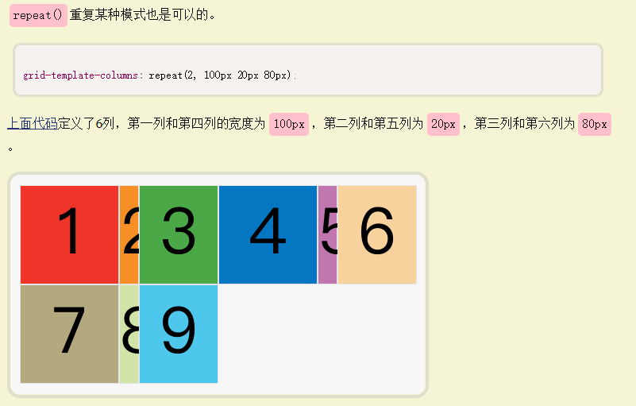
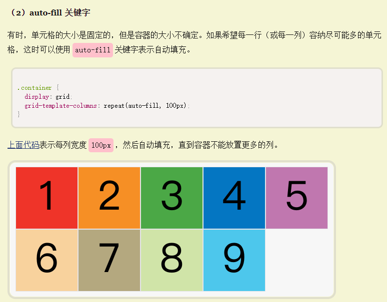
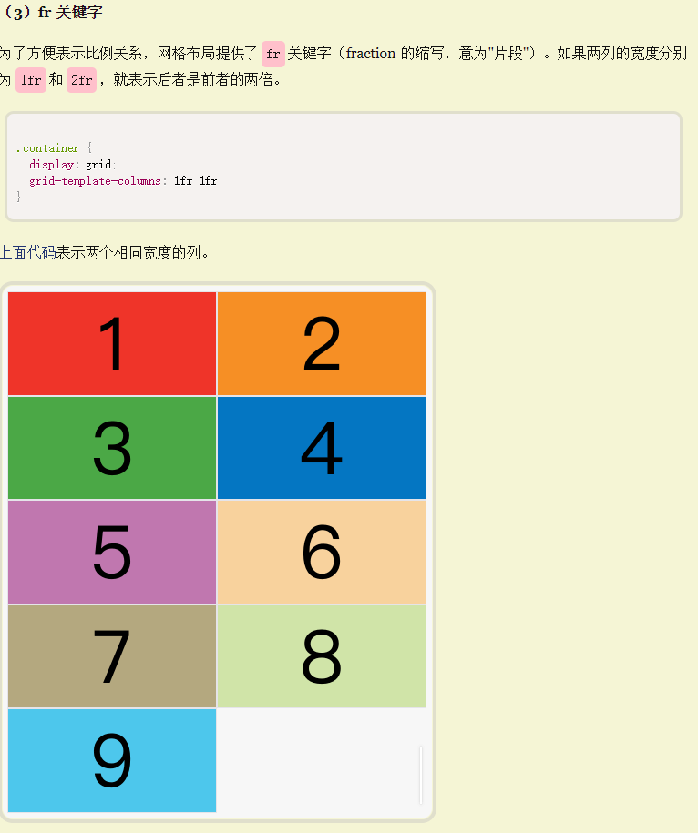

# 🟥 『Grid』

[http://www.imooc.com/wiki/css3lesson/girdinfo.html](http://www.imooc.com/wiki/css3lesson/girdinfo.html)
## 🟢Grid - 网格
```css
.demo{
    display:grid //块级的网格。
}
.demo{
    display:inline-grid; //内联级的网格。
}
```
## grid-template-columns 定义每一列-列宽
## grig-template-rows 定义每一行-行高
```css
.container {
  display: grid;
  grid-template-columns: 100px 100px 100px;
  grid-template-rows: 100px 100px 100px;
}

.container {
  display: grid;
  grid-template-columns: 33.33% 33.33% 33.33%;
  grid-template-rows: 33.33% 33.33% 33.33%;
}
```
### repeat（）
有时候，重复写同样的值非常麻烦，尤其网格很多时。这时，可以使用repeat()函数，简化重复的值。上面的代码用repeat()改写如下。
```css
.container {
  display: grid;
  grid-template-columns: repeat(3, 33.33%);
  grid-template-rows: repeat(3, 33.33%);
}
```
  

  

  


