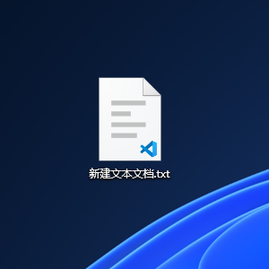
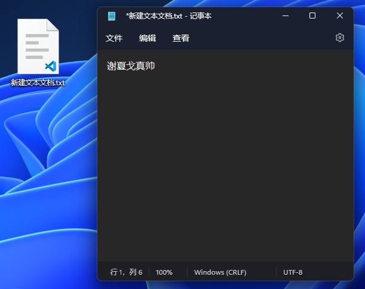
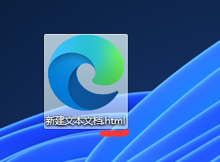
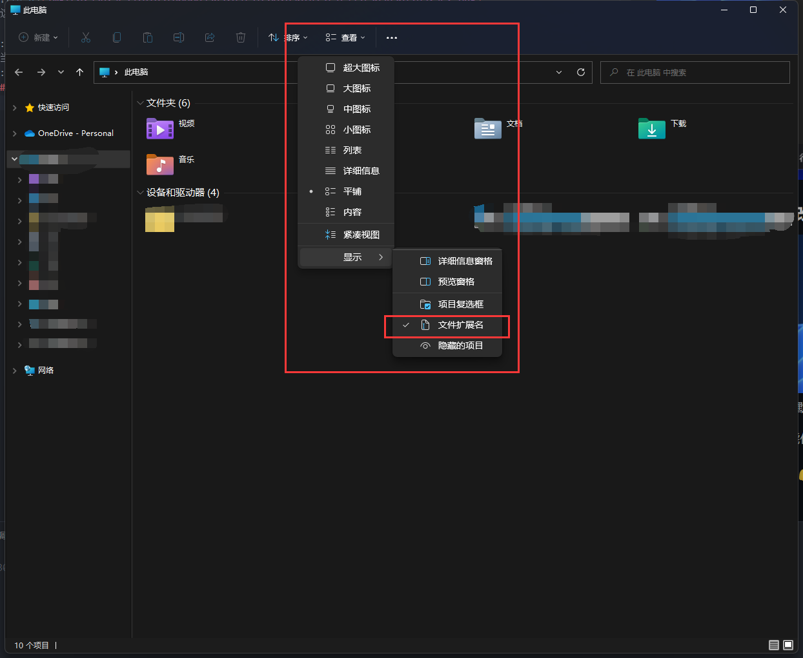
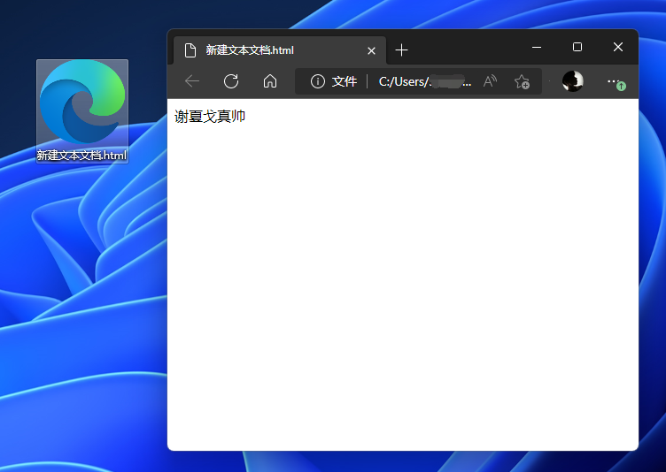

# 💻 小试牛刀 🔪

::: info 这个博客的目的
我当初刚学习制作网站，希望有指引，告诉我接下来要学习什么知识，可以做什么。  
所以接下来这个【教程】算是以一种比较轻松的方式入门，【抛砖引玉】。  
::: 

1. 先定个小目标：制作一个【纯前端的静态网页】
2. 一定要跟着教程做一遍，理解，然后做【笔记】

## 一、右键电脑桌面，新建一个txt

  

## 二、然后打上“谢夏戈真帅” 并且按保存👇
或者使用快捷键 `Ctel+S` 保存

> 通常这一步，其他人会教你打“Hello World",这也是程序员的一个典故。有兴趣可以百度了解一下。

  

## 三、关闭文件后把后缀名改成html👇
  
这时候 文件会变成你电脑默认浏览器的图标。

::: danger 注意  
如果你的文件没有txt后缀名，有可能是你的电脑没有开启【文件扩展名】 

<h3>开启【文件名】后缀👇</h3>  

打开【我的电脑】或【此电脑】，找到【查看】【显示】【文件扩展名】
   
::: 

## 四、双击打开刚刚写好的html文件👇
  

### 🥳恭喜恭喜🎉
你已经成功的写出你的第一个网页。  

你可能会说：“就这？”  

我们还没有用上更多的技术，后面我们会先去准备好我们的趁手兵器！然后继续学习！
::: info 趁手兵器？
仔细想想，如果我们打代码还要修改后缀名，改来改去。一下改成txt,一下改成html，那不得麻烦死呀....   
所以下一章，我会介绍打代码的『代码编辑器』！
:::