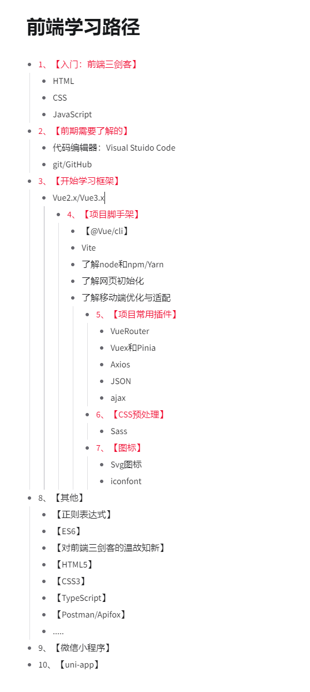

# 💻 前端学习路径

::: info  ✨学习路径  
很多博主在提供【学习路径】的时候都会罗列出很长很长的计划表。如果是零基础的小伙伴，一看就直接被劝退了....  

入门路径不宜太长！
::: 

## 💻 入门级 - 前端学习路径
入门先定好小目标：学好【基础三剑客】做个静态网页先！ 
::: tip  基础三剑客 
1. 【HTML】
2. 【CSS】
3. 【JavaScript】
::: 
后面的相关文章：
1. 第一章介绍【去哪里学习基础】，以及【学什么内容】
2. 后面会有重点/常用的代码片段、笔记
3. 以及各种遇到的坑

::: tip 建议👇
学习HTML 这些基础的时候，前面跟着敲代码，一步一步。偏后的知识不需要现在了解，否则学起来会很累。如果你全部看完，会很枯燥。  
::: 
先掌握常用的知识，做出点有成就感的画面。  
【基础不牢固】是必然会发生的，你不可能去记住全部知识，以及那些不常用的知识。  
往后你还会经常去查阅，而【了解一个大概】以及【基本使用】才是快速入门的诀窍！

等这三个学到一定程度了就可以先【仿站】
::: info 仿站
所谓【仿站】，其实就是对照着一些网站，去模仿它的外观！  
比如【模仿淘宝首页/京东首页】（都是首页...)

其实模仿完以后，这个网站并没有什么功能，只是一个外观，但是它能锻炼到你
1. HTML使用标签，
2. CSS样式！

主要是锻炼，千万不要沉迷于【哇！我做了个很好看的网站！】这样子...
::: 

## 前端学习路径
网上的前端学习路径有很多，而且很齐全，这里分享我觉得“对新手友好”的学习路径

  

