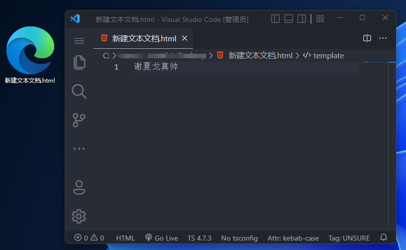

# ⚔️ 趁手兵器 

## 1、『代码编辑器』- VS code 👇

> 官方下载地址：[https://code.visualstudio.com/](https://code.visualstudio.com/)  
> 一键下载，一路下一步安装，他会自动配置好【环境变量】。

  

要想更好的打代码，我们就需要【代码编辑器】，其实它就像一个文本编辑器，只不过他多了很多关于代码的功能，以及有语法高亮。

有了它，你打代码就可以直接打开HTML的文件了。不用改后缀名 改来改去~

1. 现在前端人员的必备神器
2. 【语法高亮】
3. 【插件丰富】
4. ....

::: info Visual Studio Code
其实市面上还有其他【代码编辑器】,但是目前Visual Studio Code最流行，所以我就帮你先选择了，如果以后有兴趣再去接触其他..  
对了，它是微软家开发的，所以很强！  
:::
::: info 语法高亮?
所谓【语法高亮】就是你打一些代码的【关键名字】的时候，它会呈现出不一样的颜色来，这样看起来就漂亮很多，而不是一片黑，一片绿....  
我们称之为【可读性】
:::
::: info 插件丰富?
所谓【插件】，就是你刚安装它的时候它的基础设施很少，但是你可以【扩展】，就好比你买了一套房子，里面可能就一些基础家具，什么冰箱呀空调呀还是有的... 但是如果你想有个【跑步机】就要自己去买了。  
这里买【跑步机】，其实就是去商店安装【插件】

有了插件，这个编辑器就会越来越强大，
:::
**以后我也会推荐一些【插件】**

### 用vs code 打开上一章的html文件👇
  

## 2、『英文翻译』- 网易有道词典 👇
> 下载地址：[https://cidian.youdao.com/#/](https://cidian.youdao.com/#/)  
> 打代码一定要养成良好的习惯：  
> 其中最重要的一点就是【命名】要【语义化】   
> 而且有了它，遇到英文你也不用害怕拉！每次遇到新的单词就可以先查一下！

  
::: info 语义化?
所谓【语义化】，就好比你要表示【总数】，你就不能写“zhongshu”，你要写“sum”     
“zhongshu”会以为是【中暑、种树】，会有歧义。  
所以我们要用英文来表示，不能用拼音
:::
::: info 命名?
命名就是取名字，给【变量】/【函数】... 取名字...    
【变量】/【函数】以后学习了【JavaScript】再说...
:::

::: warning 本章收获专业术语：
1. 【代码编辑器】
2. 【语法高亮】
3. 【可读性】
4. 【插件】
5. 【语义化】
6. 【命名】
:::