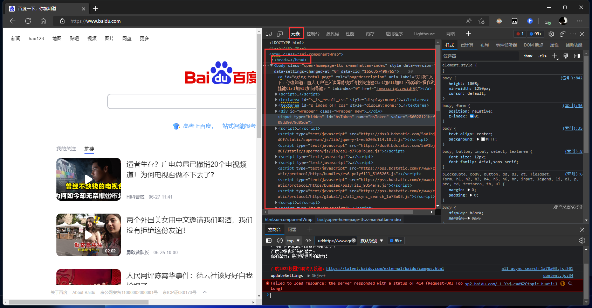
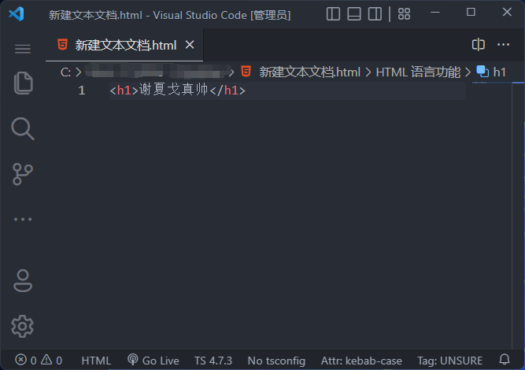
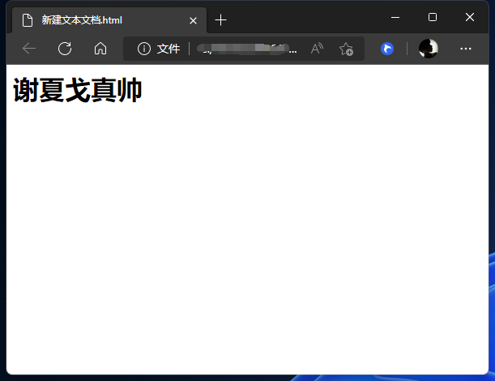
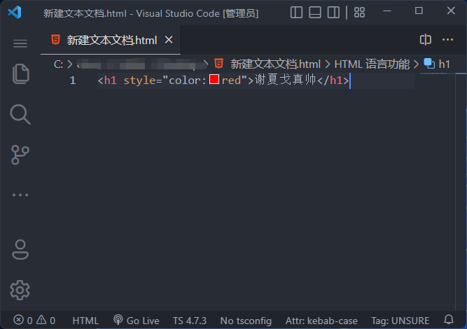
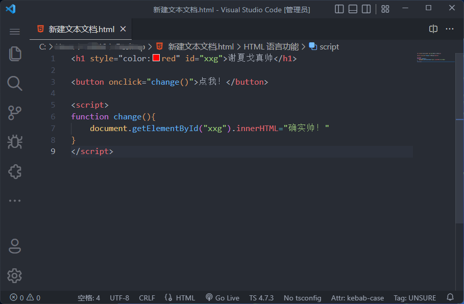
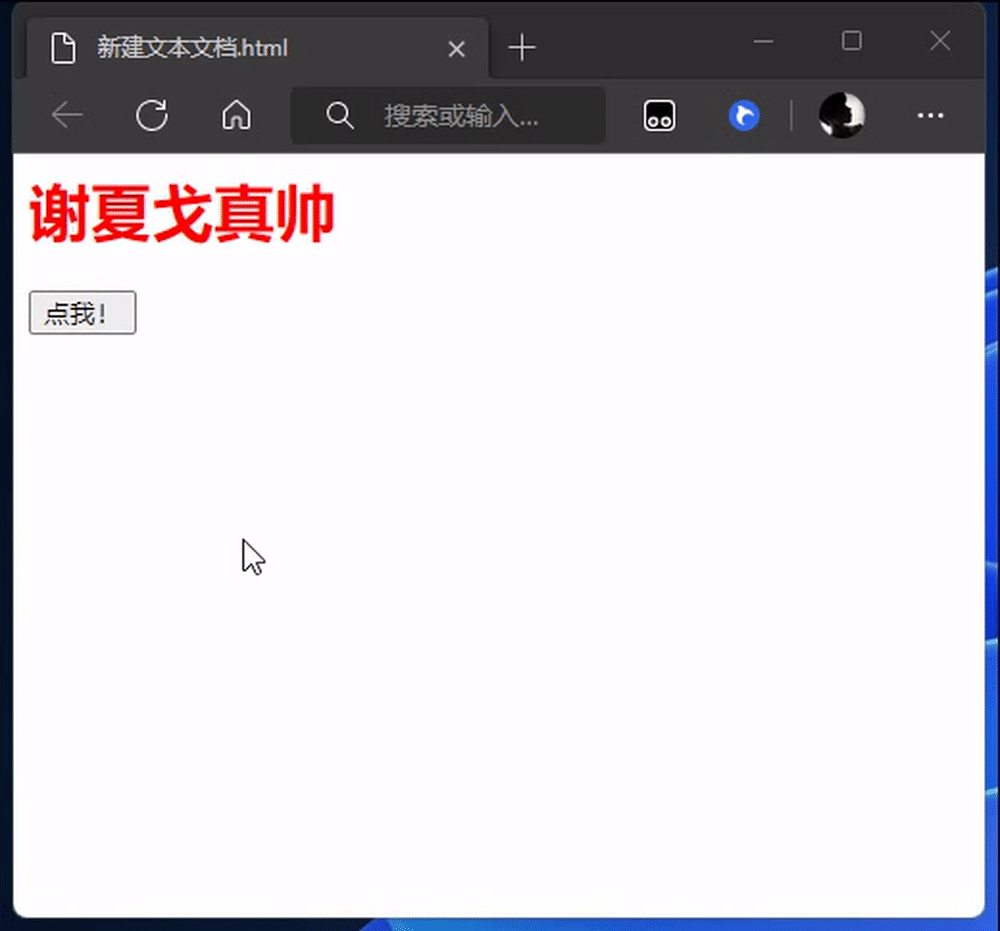

# 💻 介绍前端三剑客

1. HTML 代表着【骨架】
2. CSS 代表着【样式】
3. JavaScript 代表着【行为】

## 什么是HTML？
HTML是超文本标记语言，关键点【标记】！它不是【编程语言】

打开【浏览器】随便一个网页！然后按下键盘上的【F12】  

  

你就可以看到在【元素】处，会出现很多【尖括号】的东西，这就叫【标签】！
```html
<h1>谢夏戈真帅</h1>
```
::: tip  🌰 举个栗子 
【尖括号】中间包裹着内容  
你可以理解这个【尖括号】就是在告诉这个浏览器，这是什么！  
`<h1></h1>`就是告诉浏览器，这是【标题】  
``告诉浏览器，这是【图片】  
`<p></p>`告诉浏览器，这是【段落】.... 
::: 

所以初学HTML 就是学这些【尖括号】【标签】！

### 尝试一下
用vs code打开我们前面打的代码文件 加上【h1】的尖括号  
可以看到一前一后包裹着内容，结尾那个标签前一定要带着一个斜杠！  
> 除了极个别标签比如：img标签 和 br标签...  
> 
  

编辑完后 保存，然后打开html文件：可以看到他变成了像Word文档里的大号字标题一样！  
需要注意，css同样不是【编程语言】，它叫【样式文件】
  
::: tip  🌰 举个栗子 
可以理解HTML标签 就类似Word文档在设置字体，以及插入图片，导入超链接....
::: 

## 什么是CSS?
CSS 就是【样式】！它可以改变标签内容的颜色、大小、位置、背景颜色...等等等等  
::: tip 
前面的HTML是告诉浏览器这是什么东西，比如这是标题，这是图片，这是一个盒子    
css则是告诉浏览器，这个标题要红色，这个图片要这么大，这个盒子放在这边
:::
```html
<h1 style="color:red">谢夏戈真帅</h1>
```
  

  

## 什么是JavaScript?
JavaScript是编程语言，简称js，用于处理数据，动态修改内容....

以下仅做示范👇  
先不要理解这段代码是干嘛的，先理解JavaScript主要是用来干嘛的！起到什么作用的！
  


  

::: tip 总结
HTML：告诉浏览器这是什么东西，比如这是标题，这是图片，这是一个盒子    
CSS: 告诉浏览器，这个标题要红色，这个图片要这么大，这个盒子放在这边  
JS: 告诉浏览器，我要这样动，我要改变这个数据！
:::
## 结尾👇
这里只是简单的介绍了一下HTML、CSS和Js。   
做一个大概的了解！  

接下来请继续学习，遇到问题最好的解决方法就是“百度”“谷歌”！  
请查看本博客里的其他文章，或许能帮助到你！  

[前端学习路径](LearningPath.md) 里有我推荐的学习路径。

