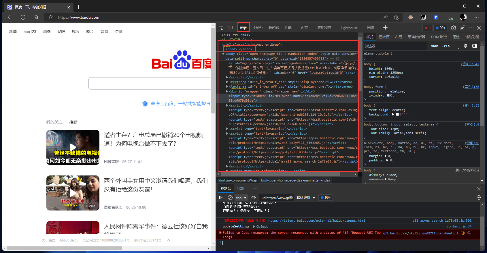

# 🟧 HTML

打开【浏览器】随便一个网页！然后按下键盘上的【F12】  

  

你就可以看到在【元素】处，会出现很多【尖括号】的东西，这就叫【标签】！
```html
<h1>谢夏戈真帅</h1>
```
::: tip  🌰 举个栗子 
【尖括号】中间包裹着内容  
你可以理解这个【尖括号】就是在告诉这个浏览器，这是什么！  
比如【h1】就是告诉浏览器，这是【最大字号】

除此之外还有【img】表示图片【p】表示段落.... 
::: 

所以初学HTML 就是学【标签】！后面当然还有别的内容但是不一定要着急学


> 菜鸟教程：[https://www.runoob.com/html/html-tutorial.html](https://www.runoob.com/html/html-tutorial.html)

::: info 
可以通过菜鸟教程先学习一部分标签的使用
:::