# 🟩 Nuxt3

## 安装：
```shell
npx nuxi init nuxt3-test
```

1. 使用cd nuxt3-test进入项目根目录.
1. 用npm install或者yarn install 来安装项目依赖包。
1. 用npm run dev或者 yarn dev来运行项目
## 手动新建文件夹👇
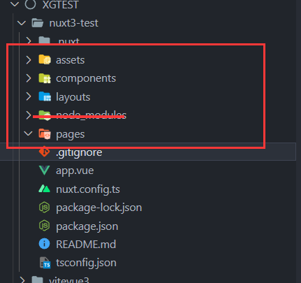  

## 固定写法👇
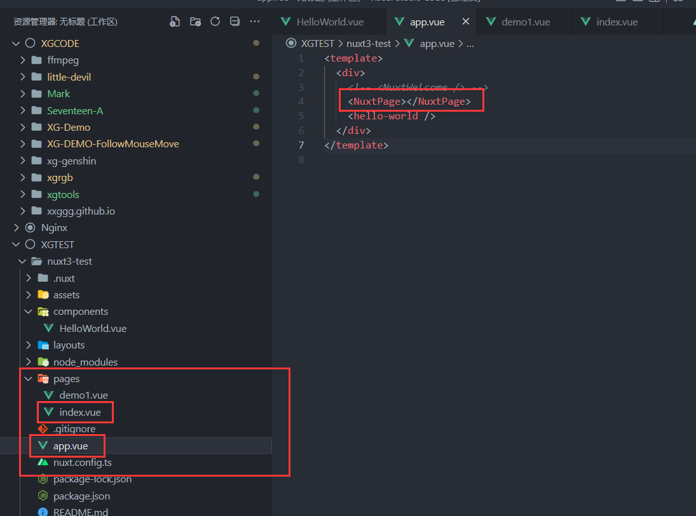  

## 跳转NuxtLink
```vue
<NuxtLink to="/demo1"></NuxtLink>
```
## 传参路由！👇
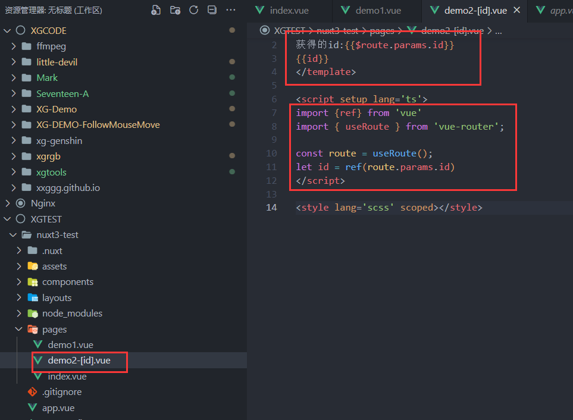  

没错！ 在文件名称上用 []  
甚至可以用在【文件夹上】
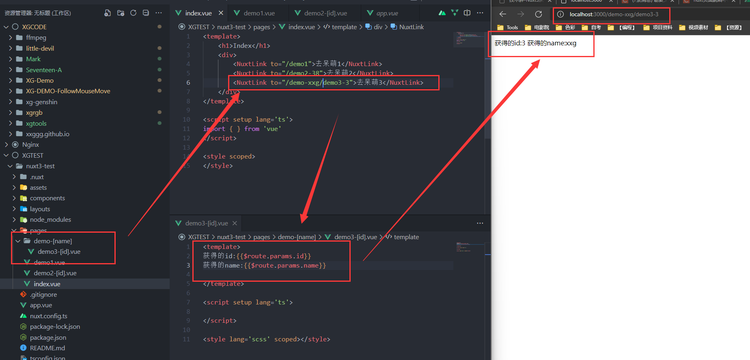  

## 嵌套路由：子路由【NuxtChild】
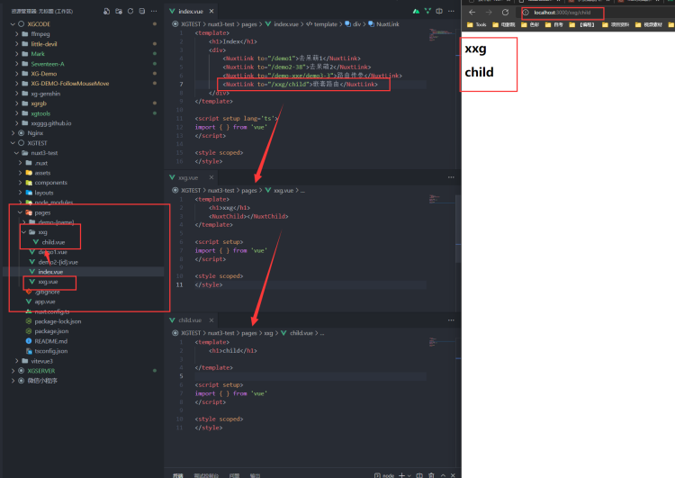  

## 布局模板👇 NuxtLayout
### 单个插槽
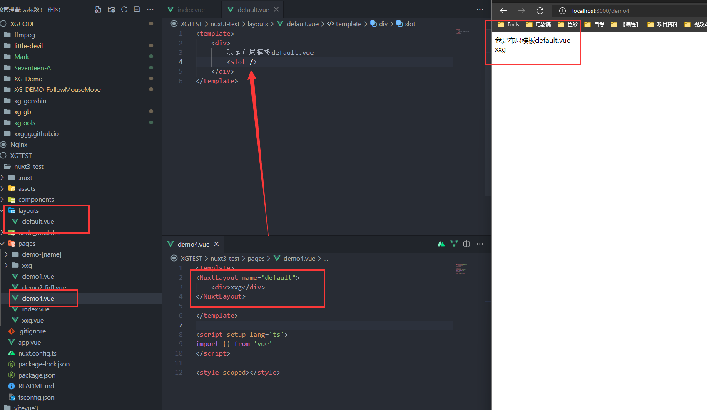  

### 多个插槽👇
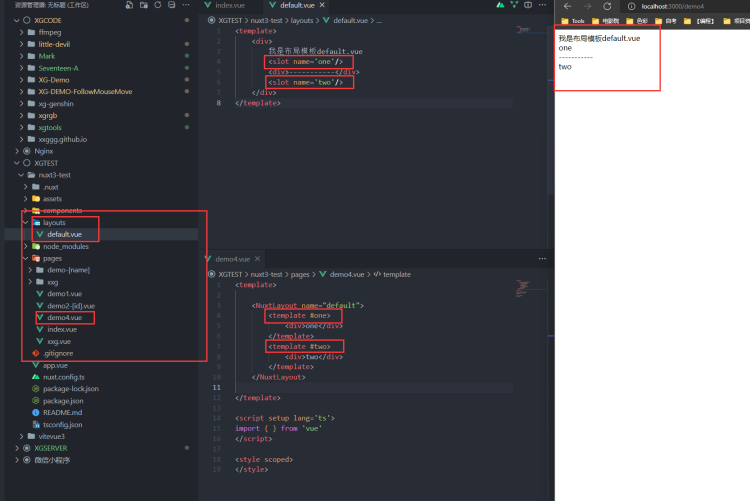  

## 组件👇
首字母必须是大写
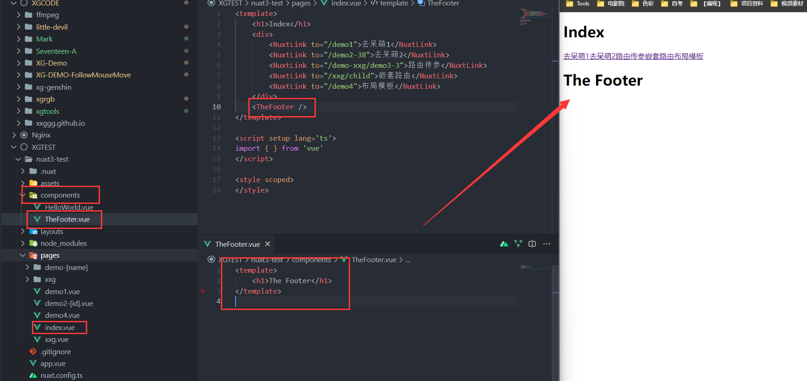  

### 多层级组件
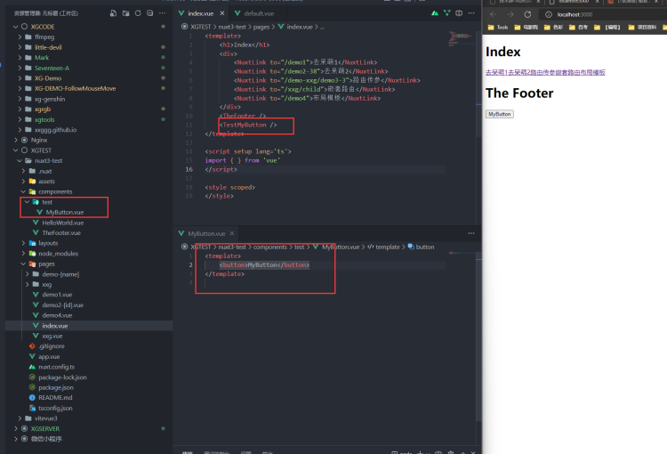  

### 组件懒加载 Lazy
需要在文件前缀【Lazy】，然后在调用时先用【v-if】隐藏，等需要再拿出来

1. 多一会显示
1. 有时显示，有时不显示（反正就是不着急显示）

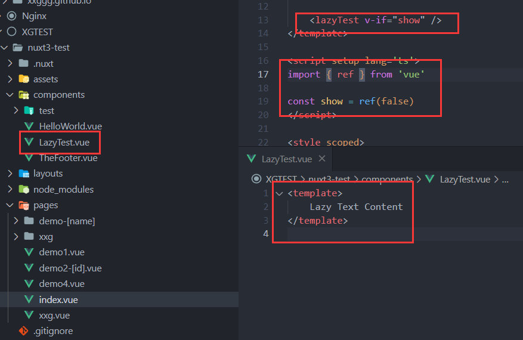  

## 模块化代码 composables

1. 共享代码
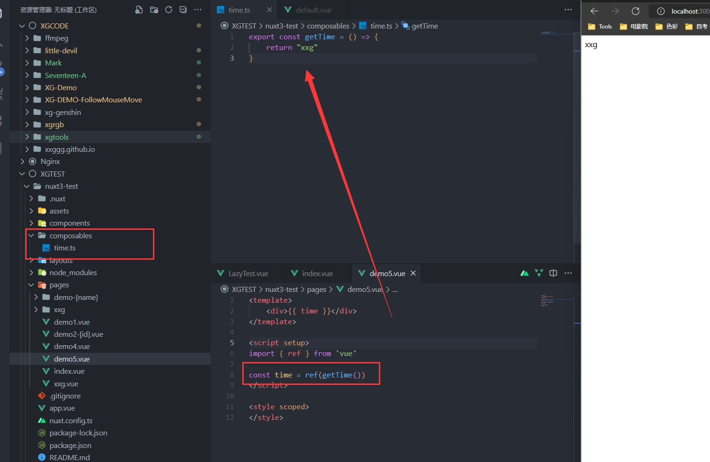  

## 请求数据👇
【学习前两种就可以】

1. useAsyncData 
1. useFetch
1. useLazyFetch
1. useLazyAsyncData

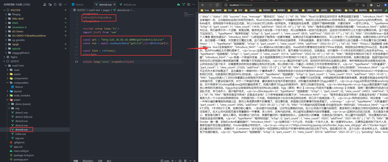  

```javascript
const url = "http:121.36.81.61:8000/getTenArticleList"
const res = await useAsyncData("getList",()=>$fetch(url))
```
```javascript
const url = "http:121.36.81.61:8000/getTenArticleList"
// const res = await useAsyncData("getList",()=>$fetch(url))
const res = await useFetch(url)
```
```javascript
const res = await useFetch(url,{method:"get",id:1})
```

