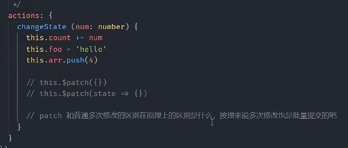

# 🍍 Pinia

Pinia类似Vuex是状态管理工具，但是听说Pinia比Vuex更加优秀！更加简单易用，好学！
## 🍍 安装
```shell
npm install pinia
```
## 🍍 引入
### 🍍 Vue3:
```typescript
//main.ts
import { createPinia } from 'pinia'

app.use(createPinia())
```
### 🍍 Vue2:
在vue2中使用，还需要安装一个插件将create注入`pinia`
```typescript
//main.ts
import { createPinia PiniaVuePlugin } from 'pinia'

Vue.use(PiniaVuePlugin)
const pinpa = cretePinia()
```
## 🍍 获取数据
```vue
<template>
    {{ Store.count }}
    <button @click="Count_add">增加</button>
</template>


<script setup lang="ts">
  //引入
  import { useStore } from '../store'
  
  //实例
  const Store = useStore()
  
  //直接修改数据
  let Count_add = () => {
    Store.count++
  }
</script>
```
### storeToRefs - 解构
```vue
<template>
    {{ count }}
    {{ foo }}
</template>


<script setup lang="ts">
import { storeToRefs } from 'pinia';
import { useStore } from '../store'
const Store = useStore()

// 解构出来👇
const { count , foo } = storeToRefs(Store)
</script>

```
## 🍍 修改数据
### 方法一：直接加
```ts
import { useStore } from '../store'
const Store = useStore()

Store.count++
```
### 方法二：使用$patch 批量更新
```ts
let Count_add = () => {
    // Store.count++
    Store.$patch({
        count: Store.count + 1,
        foo: "hello"
    })
}
```
### 方法三：更好的批量更新
```ts
let test_patch = () => Store.$patch(state => {
    state.count++
    state.foo = 'hello'
    state.arr.push(4)
})
```
### 方法四：actions
类似组件的 methods 封装组件的业务逻辑 修改state

- 逻辑比较多的时候可以封装到 actions 做处理
- 【注意】：不要使用箭头函数定义 actions（因为箭头函数里 this指向问题！）
```ts
//【actions】设置
//store/index.ts
import { defineStore } from "pinia";
export const useStore = defineStore('main',{
    state:()=>{
        return{
            count:100,
            foo:'foo',
            arr:[1,2,3]
        }
    },

    // 类似于组件的computed 用来封装计算属性，有缓存功能
    getters:{},

    //类似组件的 methods 封装组件的业务逻辑 修改state
    actions:{
        changeState(){
            this.count++
            this.foo = 'xxggg',
            this.arr.push(4)
        }
    },
})
```
```ts
//【actions】调用
// home.vue
import { useStore } from '../store'
const Store = useStore()

const button = () => [
  Store.changeState()//可以传参Store.changeState(10)
}
  
```
  


- 普通多次修改和patch的区别再于
1. 普通多次修改，每修改一次数据，模板更新一次，
2. patch是把所有数据都同时修改完成后，模板一次全给更新了！有利于性能！【推荐】
## 🍍 getters
类似于组件的computed 用来封装计算属性，有缓存功能
```typescript
//store/index.ts
state:()=>{
        return{
            count:100,
            foo:'foo',
            arr:[1,2,3],
            phone:'15139333888'
        }
    },

    // 类似于组件的computed 用来封装计算属性，有缓存功能
    getters:{
        PhoneHidden(state){
            console.log("getters")
            return state.phone.toString().replace(/^(\d{3})\d{4}(\d{4})$/,'$1****$2')
        }
    },
```
```typescript
//home.vue
{{ Store.PhoneHidden }}
```
## 🍍 Pinia中Store的相互调用
在store文件夹下新建xxg.ts
```typescript
import { defineStore  } from "pinia";

export const xxgStore = defineStore('xxg',{
    state:()=>{
        return{
            list:[11,22,33],
        }
    },
})
```
在index.ts中调用
```typescript
import { defineStore } from "pinia";
import { xxgStore } from './xxg'

export const useStore = defineStore('main', {
    state: () => {
        return {
            count: 100,
					//...
        }
    },

    // 类似于组件的computed 用来封装计算属性，有缓存功能
    getters: {
        //...
    },

    //类似组件的 methods 封装组件的业务逻辑 修改state
    actions: {
        //...
        getList(){
            console.log(xxgStore().list)
        }
    },
})
```
