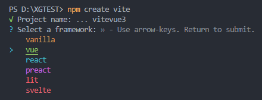
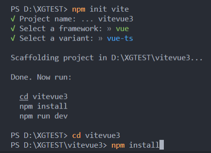

# ⚡ Vite

::: tip 官方网站
Vite：[https://vitejs.dev/](https://vitejs.dev/)
::: 
### ⚡ 环境依赖
-  node.js
-  Vite只能运行Vue3.x以上版本，不能运行Vue2.x
### ⚡ 安装Vite 创建项目
```sh
npm init vite
```
  

  

### ⚡ Vite 开发流程
1. ⚡ 安装Vite 创建项目
2. ⚡ Vite 区分环境
3. ⚡ Vite 跨域
4. 🍼 网页初始化
5. 📱 移动端优化与适配
6. 🪱 配置 Scss/Sass
7. 🧩 配置 VueRouter
8. 🧩 配置 Vuex或Pinia
9. 📡 配置Axios以及二次封装