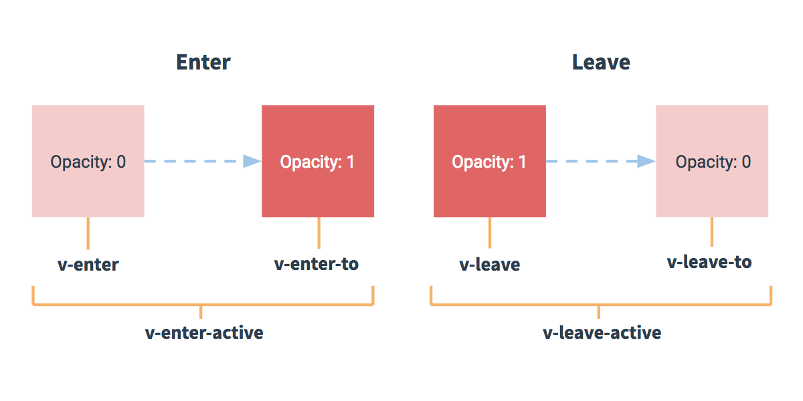

# 🟩 Vue 过渡 & 动画

```html
<transition name="fade">
	<p v-show = "show" >hello !</p>
</transition>

<style>
.fade-enter-active, .fade-leave-active {
	transition: opacity 3s
}
.fade-enter, .fade-leave-to {
	opacity: 0
}
</style>
```
可以理解为在【p这个标签】通过 `v-show` 出现的时候，外层包裹着`transition`!  
这个`transition`通过它的`name`属性，让它有了动画效果！

- v-enter：进入阶段的开始
- v-enter-active：整个进入的过程
- v-enter-to: 进入阶段的结束

---
- v-leave: 离开阶段的开始
- v-leave-active：整个离开的过程
- v-leave-to: 离开阶段的结束

前缀这个`v`就是`transition`的`name`属性的名字！

  
