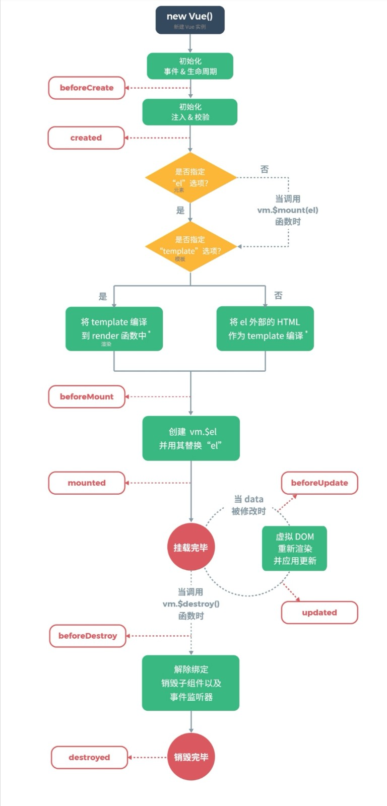

# 🟩 Vue2 生命周期

  

### 🟩 创建前（beforeCreate）
在实例初始化之后，此时的数据观察和事件机制都未形成，不能获得 DOM 节点。
### 🟩 创建后（created）
实例已经创建完成之后被调用。在这一步，实例已完成以下的配置：数据观测（data observer），属性和方法的运算， watch/event 事件回调。然而，挂载阶段还没开始。
### 🟩 载入前（beforeMount）
在挂载开始之前被调用：这个过程是在模版已经在内存中编译完成， render 函数首次被调用，此时完成了虚拟 DOM 的构建，但并未被渲染。
### 🟩 载入后（mounted）
这个过程在模版挂载之后被调用，页面完成渲染，所以在这之后，我们可以操作和访问 DOM 元素。
### 🟩 更新前（beforeUpdate）
当数据更新时调用，在这一阶段 DOM 会和更改过的内容同步。
### 🟩 更新后（updated）
由于数据更改导致的虚拟 DOM 重新渲染和打补丁，在这之后会调用该钩子。
当这个钩子被调用时，组件 DOM 已经更新，所以你现在可以执行依赖于 DOM 的操作。然而在大多数情况下，你应该避免在此期间更改状态，因为这可能会导致更新无限循环。
### 🟩 销毁前（beforeDestroy）
实例销毁之前调用。在这一步，实例仍然完全可用。
### 🟩 销毁后（destroyed）
Vue 实例销毁后调用。调用后，Vue 实例指示的所有东西都会解绑定，所有的事件监听器会被移除，所有的子实例也会被销毁。