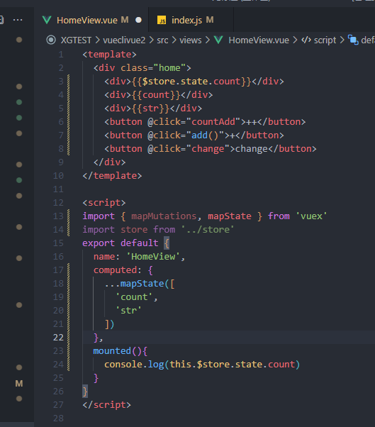
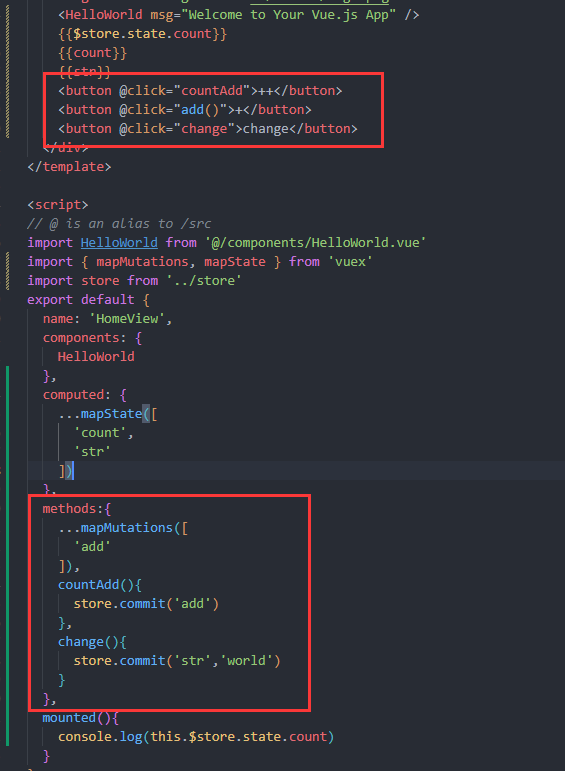

# 🧩 Vuex

## 🟢 安装
```shell
npm install vuex --save
```
## 🟢引入
### Vue2
```javascript
// src/store/index.js👇
import Vue from 'vue'
import Vuex from 'vuex'
Vue.use(Vuex) 

export default = new Vuex.Store({
  state: {
    count: 0 //设定初始状态
  },
  mutations: {  //设置改变状态的方法
    add(state,n){ //第一个参数一定写state，第二就是由触发的页面传来的参数了！
        state.count+=n;
    },
    reduce(state){
        state.count--;
    }
  },
  actions: {
  },
  getters: {
  }
})
```
```javascript
import store from './store'

new Vue({
    el:'#app',
    store 
})
```
### Vue3、Vite
```javascript
// src/store/index.js👇
import { createStore } from 'vuex'
 
const store = createStore({
  state: {  
	  test:'test1'
  },
  mutations: {   
  },
  actions: {
  },
  getters: {
  }
})
 
export default store
```
```javascript
//main.ts 入口文件
import { createApp } from 'vue'
import App from './App.vue'
import router from './router'
import store from './store'
const app =  createApp(App)
app.use(router).use(store).mount('#app')
```
## 🟢【State】
### 🟢设置初始值
```javascript
import Vue from 'vue'
import Vuex from 'vuex'

Vue.use(Vuex)

export default new Vuex.Store({
  state: {
    count:0,
    str:'Hello'
  },
  getters: {
  },
  mutations: {
  },
  actions: {
  },
  modules: {
  }
})
```

### 🟢 在 Vue 组件中获得 Vuex 状态
```vue
<div>{{$store.state.count}}</div>
```
```javascript
console.log(this.$store.state.count)
```
### 🟢 对象展开运算符
> 在vue 的构造器里边只能有一个computed属性，如果你写多个，只有最后一个computed属性可用，所以写的computed属性进行一个改造。改造时我们使用ES6中的展开运算符"…"。

```javascript
//👇 这样写
computed: {
    ...mapState([
        'num',
        'count',
    ])
}
```
```vue
<div>{{count}}</div>
<div>{{str}}</div>
```
  

## 🟢【Mutation】改值
> mutation 都是同步事务

### 🟢定义方法👇
```javascript
//src/store/index.js
import Vue from 'vue'
import Vuex from 'vuex'

Vue.use(Vuex)

export default new Vuex.Store({
  state: {
    count:0,
    str:'Hello'
  },
  getters: {
  },
  mutations: {
    add(state){
      state.count ++
    },
    str(state,data){
      state.str = data
    }
  },
  actions: {
  },
  modules: {
  }
})
```
### 🟢 调用方法
```javascript
countAdd(){
  store.commit('add')
}
Change(){
  store.commit('str','world')
}
```
  

### 🟢【Mutation 辅助函数】
> 在vue 的构造器里边只能有一个computed属性，如果你写多个，只有最后一个computed属性可用，所以写的computed属性进行一个改造。改造时我们使用ES6中的展开运算符"…"。

```javascript
import { mapMutations } from 'vuex'

export default {
  // ...
  methods: {
    ...mapMutations([
      'add', 
      // 将 `this.increment()` 映射为 `this.$store.commit('add')`
    ]),
    ...mapMutations({
      add: 'increment' 
      // 将 `this.add()` 映射为 `this.$store.commit('increment')`
    })
  }
}
```
> **前面的mapState在computed里，而mapMutations是在methods方法里**


---

## 🟢【Getter】
> getters从表面是获得的意思，可以把他看作在获取数据之前进行的一种再编辑,相当于对数据的一个过滤和加工。可以把它看作store.js的计算属性。

```javascript
const store = new Vuex.Store({
  state: {
    count:1
  },
  mutations: {
    add(state){
      state.count++;
    },
    reduce(state){
      state.count--;
    }
  },
  getters: {
    //过滤，就是把运算过程拉到这个地方来
    count:function(state){
      return state.count += 100;
    }
    //在输出前 加上一百
  }
})
```
### 🟢 通过属性访问
Getter 会暴露为 store.getters 对象，你可以以属性的形式访问这些值：
```javascript
store.getters.count // -> 101
```
```html
<div>{{$store.getters.count}}</div>
```
### 🟢 Getter 也可以接受其他 getter 作为第二个参数：

```javascript
getters: {
  // ...
  doneTodosCount: (state, getters) => {
    return getters.doneTodos.length  //输出todolist的条数
  }
}
```

```javascript
store.getters.doneTodosCount // -> 1
```

我们可以很容易地在任何组件中使用它：👇

```javascript
computed: {
  doneTodosCount () {
    return this.$store.getters.doneTodosCount
  }
}
```

注意，getter 在通过属性访问时是作为 Vue 的响应式系统的一部分缓存其中的。
### 🟢 通过方法访问
```javascript
getters: {
  // ...
  getTodoById: (state) => (id) => {
    return state.todos.find(todo => todo.id === id)
  }
}
```

```javascript
store.getters.getTodoById(2) // -> { id: 2, text: '...', done: false }
```

注意，getter 在通过方法访问时，每次都会去进行调用，而不会缓存结果。

### 🟢 `mapGetters` 辅助函数

> 在vue 的构造器里边只能有一个computed属性，如果你写多个，只有最后一个computed属性可用，所以写的computed属性进行一个改造。改造时我们使用ES6中的展开运算符"…"。


`mapGetters` 辅助函数仅仅是将 store 中的 getter 映射到局部计算属性：

```javascript
import { mapGetters } from 'vuex'

export default {
  // ...
  computed: {
  // 使用对象展开运算符将 getter 混入 computed 对象中
    ...mapGetters([
      'doneTodosCount',
      'anotherGetter',
      // ...
    ])
  }
}
```

---

## 🔵【Action】

- Action 提交的是 mutation，而不是直接变更状态。
- Action 可以包含任意异步操作。
> 简单点说就是在index.js这个文件里Action来调用mutations里的方法

让我们来注册一个简单的 action：
```javascript
const store = new Vuex.Store({
  state: {
    count: 0
  },
  mutations: {
    add(state){
      state.count++;
    },
    reduce(state){
      state.count--;
    }
  },
  actions: {
    addAction(context){
        context.commit('add',10)
        //可以把这里的context理解成像上面的state一样，
        //而又因为要触发mutations需要使用到commit 所以就整体变成了context.commit
    },
    reduceAction({commit}){
        commit('reduce')
    }
  }
})
```

- `context`：上下文对象，这里你可以理解称store本身。
- `{commit}`：直接把commit对象传递过来，可以让方法体逻辑和代码更清晰明了。

Action 函数接受一个与 store 实例具有相同方法和属性的 context 对象，因此你可以调用 context.commit 提交一个 mutation，或者通过 context.state 和 context.getters 来获取 state 和 getters。当我们在之后介绍到 Modules 时，你就知道 context 对象为什么不是 store 实例本身了。

### 🔵 调用👇 【mapActions辅助函数】
```html
<p>
  <button @click="addAction(可以加参数)">+</button>
  <button @click="reduceAction">-</button>
</p>
```

```javascript
import { mapState,mapMutations,mapActions} from 'vuex';
//...
methods:{
    ...mapMutations([  
        'add','reduce'
    ]),
    ...mapActions(['addAction','reduceAction'])
},
```
### 🔵 增加异步检验
我们现在看的效果和我们用Mutations作的一模一样，肯定有的小伙伴会好奇，那actions有什么用，我们为了演示actions的异步功能，我们增加一个计时器（setTimeOut）延迟执行。在addAction里使用setTimeOut进行延迟执行。
```javascript
setTimeOut(()=>{context.commit(reduce)},3000);
console.log('我比reduce提前执行');
//这些是写在actions里面的！
```
> 简单点说，如果是使用mutations就要等3秒后执行了这个任务才往下走。
而使用actions异步就是，你这边还要三秒后才执行，那就先等着，我先执行下面的，等三秒后我再回来执行你这个破鬼任务~


---

### 🔵 分发 Action （也就是使用、调用）
Action 通过 `store.dispatch` 方法触发：
```javascript
store.dispatch('increment')
```

乍一眼看上去感觉多此一举，我们直接分发 mutation 岂不更方便？实际上并非如此，还记得 mutation 必须同步执行这个限制么？Action 就不受约束！我们可以在 action 内部执行异步操作：
```javascript
actions: {
  incrementAsync ({ commit }) {
    //这里要么写{commit} 要么写 context
    setTimeout(() => {
      commit('increment')
      //如果上面写了{commit} 这里就写commit
      //如果上面写了context 这里就写context.commit
    }, 1000)
  }
}
```
Actions 支持同样的载荷方式和对象方式进行分发：（也就是可以添加参数，这里的专业名词什么“载荷”、什么“分发”，其实就是参数、调用）
```javascript
// 以载荷形式分发
//dispatch的英文单词意思是 -> 派遣、发送、处理
store.dispatch('incrementAsync', {
  amount: 10
})

// 以对象形式分发
store.dispatch({
  type: 'incrementAsync',
  amount: 10
})
```

> 👆 这个和 mutation 一样

### 🔵 在组件中分发 Action
```javascript
import { mapActions } from 'vuex'

export default {
  // ...
  methods: {
    ...mapActions([
      'increment', // 将 `this.increment()` 映射为 `this.$store.dispatch('increment')`

      // `mapActions` 也支持载荷：
      'incrementBy' // 将 `this.incrementBy(amount)` 映射为 `this.$store.dispatch('incrementBy', amount)`
    ]),
    ...mapActions({
      add: 'increment' // 将 `this.add()` 映射为 `this.$store.dispatch('increment')`
    })
  }
}
```
> 跟其他的分发一样.....

### 🔵 组合 Action
Action 通常是异步的，那么如何知道 action 什么时候结束呢？更重要的是，我们如何才能组合多个 action，以处理更加复杂的异步流程？
首先，你需要明白 store.dispatch 可以处理被触发的 action 的处理函数返回的 Promise，并且 store.dispatch 仍旧返回 Promise：
```javascript
actions: {
  actionA ({ commit }) {
    return new Promise((resolve, reject) => {
      setTimeout(() => {
        commit('someMutation')
        resolve()
      }, 1000)
    })
  }
}
```
现在你可以：
```javascript
store.dispatch('actionA').then(() => {
  // ...
})
```
在另外一个 action 中也可以：
```javascript
actions: {
  // ...
  actionB ({ dispatch, commit }) {
    return dispatch('actionA').then(() => {
      commit('someOtherMutation')
    })
  }
}
```
最后，如果我们利用 async / await，我们可以如下组合 action：
```javascript
// 假设 getData() 和 getOtherData() 返回的是 Promise

actions: {
  async actionA ({ commit }) {
    commit('gotData', await getData())
  },
  async actionB ({ dispatch, commit }) {
    await dispatch('actionA') // 等待 actionA 完成
    commit('gotOtherData', await getOtherData())
  }
}
```

一个 store.dispatch 在不同模块中可以触发多个 action 函数。在这种情况下，只有当所有触发函数完成后，返回的 Promise 才会执行。
## 🔵【Module】
随着项目的复杂性增加，我们共享的状态越来越多，这时候我们就需要把我们状态的各种操作进行一个分组，分组后再进行按组编写。
```javascript
const moduleA = {
  state: () => ({ ... }),
  mutations: { ... },
  actions: { ... },
  getters: { ... }
}

const moduleB = {
  state: () => ({ ... }),
  mutations: { ... },
  actions: { ... }
}
//比如这里分了A B 两组 A管理的是什么什么东西 ，
//B管理的是另外的东西，（哪怕有相同的变量也互不干扰）
//然后把之前写改成分组的方式来传递到组件中去使用
const store = new Vuex.Store({
  modules: {
    a: moduleA,
    b: moduleB
  }
})
//下面这个是使用方法：就是在拿状态的值时要区分是a，还是b。
store.state.a // -> moduleA 的状态
store.state.b // -> moduleB 的状态
```

---

使用👇
```html
<h3>{{$store.state.a.count}}</h3>
```
```javascript
computed:{
    count(){
        return this.$store.state.a.count;
    }
},
```
