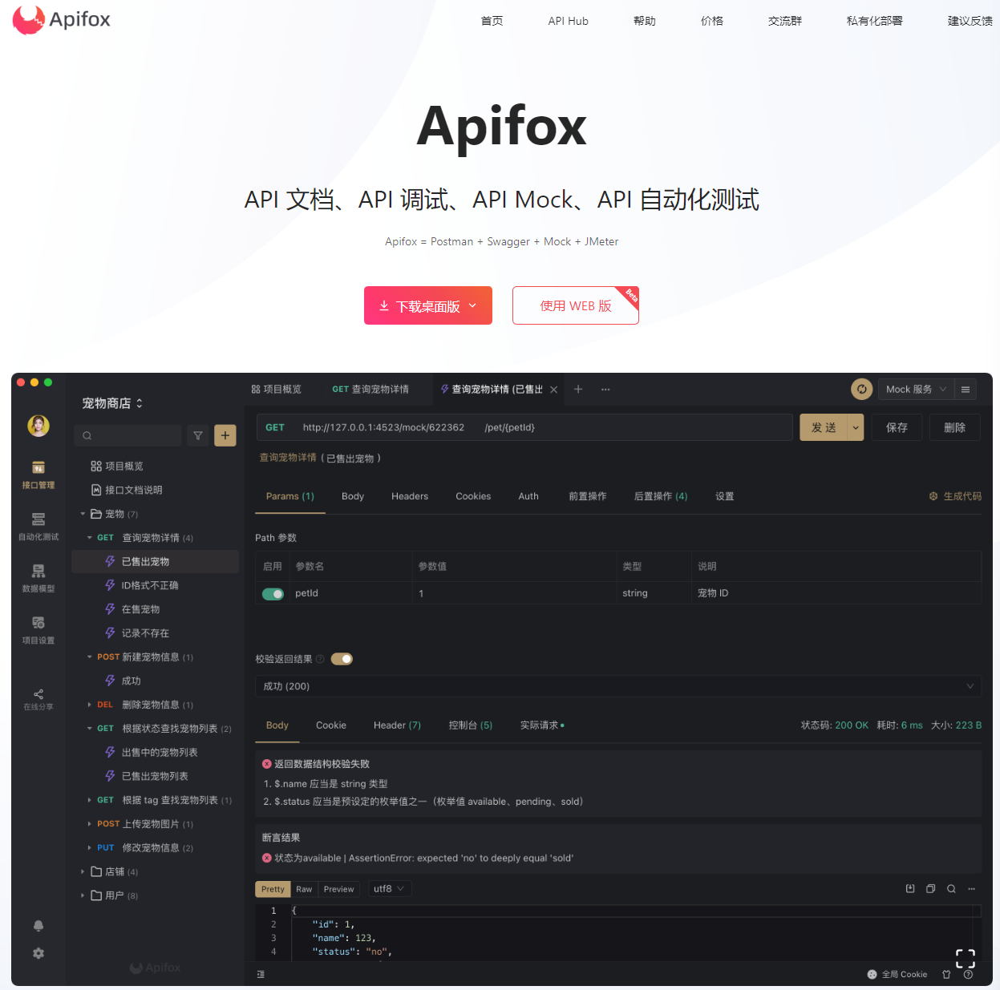
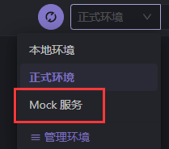

# ⭕ ApiFox

- ⭕ ApiFox：[https://www.apifox.cn/](https://www.apifox.cn/) 
- 🔷 Apipost：[https://www.apipost.cn/](https://www.apipost.cn/)
- 🟠 Postman：[https://www.postman.com/](https://www.postman.com/)

以上三样是调试api接口的软件工具，前端后端人员都要使用。业内Postman是很出名的。 

但是最近使用ApiFox还不错。ApiFox、Apipost是国产软件。

  

### ApiFox、Apipost优点：
1. 免费
2. 国产软件，有中文。
3. 有模拟数据 - mock
4. 自动生成文档

::: tip Mock服务
  

Mock服务可以生成一个【模拟数据】的api接口，供前端开发人员临时使用。    
在后端接口还没写好时，前端可以先拿模拟数据来写页面测试~  
:::