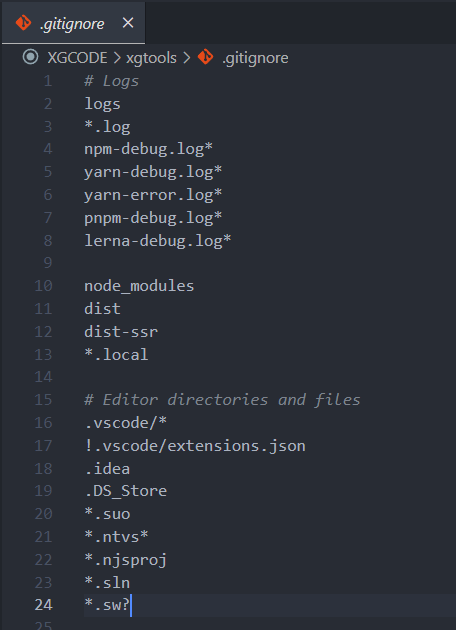

# 🐈‍⬛ Git

Git 是一个开源的分布式版本控制系统，用于敏捷高效地处理任何或小或大的项目。

> 上面这句话听着是不是很懵，其实👇

Git就是一个备份你代码的工具... 使用它备份你的代码，备份多个版本，可以回溯之前的版本。  
如果只使用git，那么这个备份只存在你的本地电脑上。 

要把备份的文件提交上GitHub、gitee或gitlab这些【代码管理平台】。  
Git才发挥真正的作用！当你的电脑坏了代码不见了，在另一台电脑上你可以从Github 拉取你之前备份的代码。

跟公司的人协同开发时，也可以你改你的部分，我改我的，最后把文件合并起来！  
测试接下来要添加的新功能时，也可以开多一条分支出来~  

另外，好的项目上传Github开源，也可以给别人拿去用！或者让人参与进来。  
总而言之，Git是每个程序员必须会的！  
::: tip 基础知识、推荐学习网址：
[Git教程 | 菜鸟教程](https://www.runoob.com/git/git-tutorial.html)  
[Git教程 | 廖雪峰老师的教程！](https://www.liaoxuefeng.com/wiki/896043488029600/)

当然，我也会在这里列出一些常用命令的笔记！👇  
【未来再做教程】
:::

## 🔨 安装（windows）
> 官网下载：https://git-scm.com/downloads  


安装完成后，在开始菜单里找到“Git”->“Git Bash”
```shell
git config --global user.name "你的名字"
git config --global user.email "你的邮@箱地址.com"
```

## ⭐ 常用Git命令

### 🔧 创建本地仓库
初始化（文件夹内会多出 .git的隐藏文件夹）
```shell
git init        
```
### 🪢 绑定远程仓库
绑定你GitHub上的仓库
```shell
git remote add github <你的项目地址>
```
### ➕ 添加到暂存区
输入`git add .` 后，修改过的文件就会暂时先到“暂存区”     
```shell
git add <你要备份的文件名>
git add .  
```
`.` 表示添加全部修改过的文件

### ⬆️ 提交到本地仓库-附说明
commit会把包括在“暂存区”的文件一起，备份出一个版本   
```shell
git commit -m '说明'
```
### ⏏️ 推送到远程仓库
push 会把你备份好的所有版本推送到GitHub上。  
```shell
git push
```
### 👆 首次推送
绑定完仓库后首次提交push 要这样👇
```shell
git push -u origin main
```

### 📩 克隆远程仓库到本地
把GitHub上的代码拉下来，无论是自己的还是别人的都可以用克隆...   
```shell
git clone <远程代码库地址>
git clone git@github.com:XXGGG/test.git
```

---
### 👁️ 查看当前分支
```shell
git branch
```
### ⛏️ 创建分支
```shell
git branch <新分支的名字>
```
### 🔃 切换分支
```shell
git checkout <分支的名字>
```
### 🔃 创建并切换分支
```shell
git checkout -b dev
```
### 🈴 合并分支
```shell
git merge <分支> 
//这个意思是把分支合并到 当前的分支  
//假设当前的是master主分支，那就是把<分支>合并到当前分支
```
### 🗑️ 删除分支
```shell
git branch -d <分支>
```

#### 其他
还有一些其他的命令，但是不算常用。放另一章，或者以后再记录...

## ⛔ 忽略的文件

在项目根目录里编写 `.gitignore`文件  
  

不想push的文件,比如：`node_modules`

  
