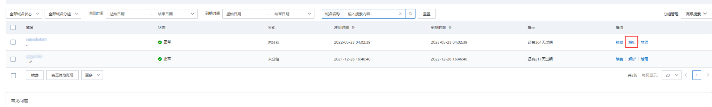
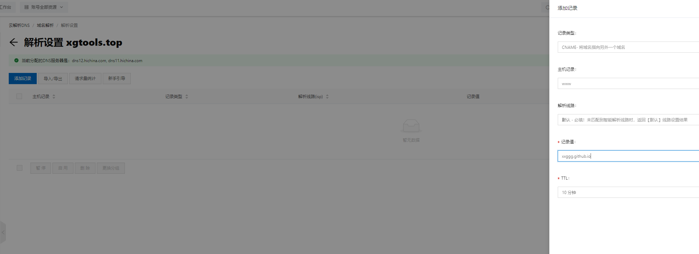
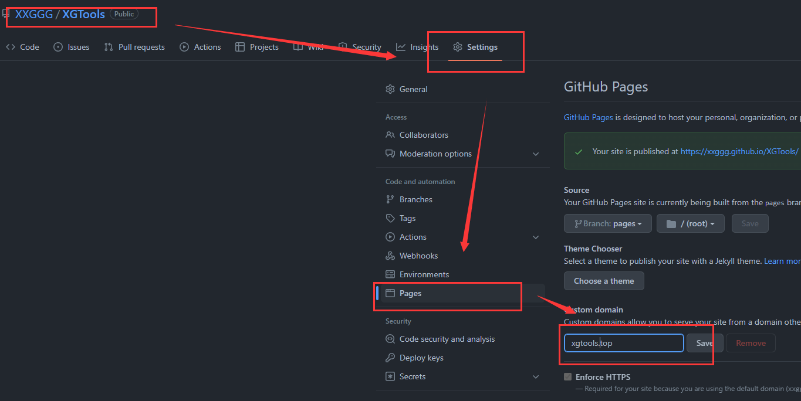
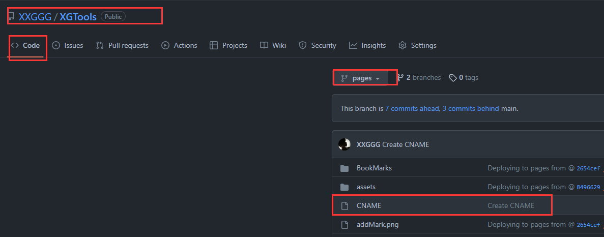

# 🤳 Github pages 自定义域名

## 💸 购买域名

万网：[https://wanwang.aliyun.com/](https://wanwang.aliyun.com/)

## 🔓 域名解析
    
  

## ⚒️ 配置
到github仓库对应项目的Settings页的pages项进行配置
  

这时候！文件根目录会多出一个文件【CHAME】，是GitHub帮我们添加的！
  

等待10分钟后就可以使用自定义的域名访问GitHub Pages站点了。