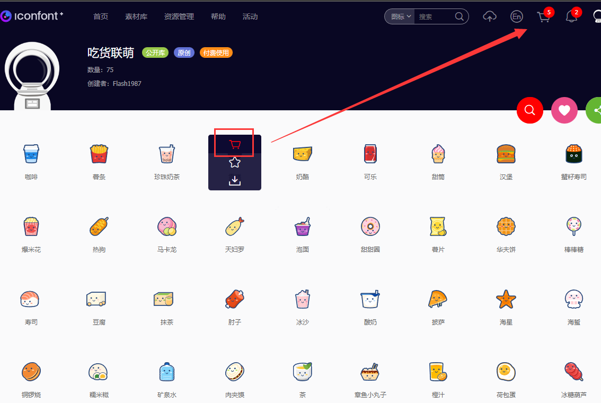
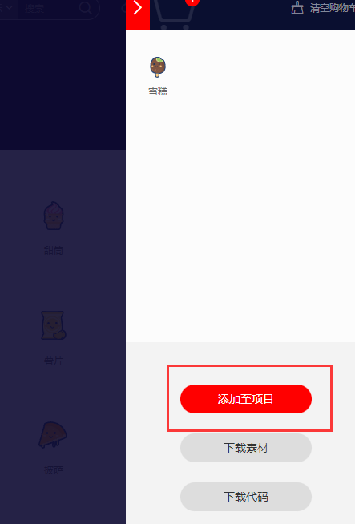
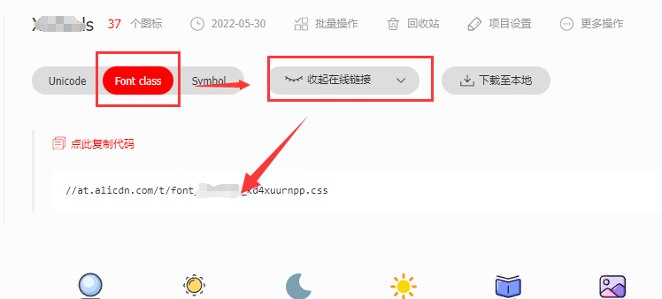
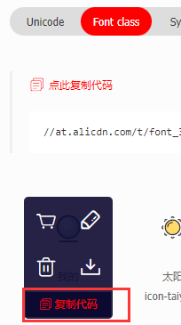
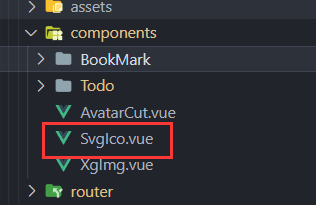

# 😀 Iconfont

**iconfont是一种图案字体！可以在你的项目中使用上图标**

1. 进入网站：Iconfont网址：[http://www.iconfont.cn](http://www.iconfont.cn)
1. 点击网站上方的“官方图标库”，选择自己喜欢的图标。
1. 选择好自己喜欢的图标，两个选择，【下载代码】 和 【添加至项目】。  

1. 选择添加至项目，然后新建项目，并输入名称。  

1. 项目添加好后，会自动给我们转入到我们项目库中。点击查看【在线链接】。
1. 生产css引入的代码，生成后就可以在项目首页index.html引入了。  

> 这种方法是font-class👇

```html
<!-- index.html -->
<link rel="stylesheet" href="http://at.alicdn.com/t/font_wyhhdpv5lhvbzkt9.css">
<link rel="stylesheet" href="http://at.alicdn.com/t/font_2321846_tri6lxxuil8.css">
```

```html
<i class="icon iconfont icon-hanbao"></i>
```
  


::: tip 提示
- 如果iconfont图标不够了 可以继续去挑选 - 添加到项目
- 然后重新生成【链接】，引入【链接】。
:::
  
## 😁 Symbol【推荐】

- 支持多色
- 兼容性差 
- 浏览器渲染svg的性能一般，还不如png。

引入项目下面生成的symbol代码
```html
<script src="./iconfont.js"></script>
```
或者👇
```html
<script src="http://at.alicdn.com/t/font_2321846_tri6lxxuil8.js"></script>
```
然后引入通用样式（只需引入一次）
```html
<style type="text/css">
.icon {
    width: 1em; htight: 1em;
    vertical-align: -0.15em;
    fill:currentColor;
    overflow:hidden;
}
</style>
```
```html
<svg class="icon" aria-hidden="true">
    <use xlink:href="#icon-xxx"></use>
</svg>
```
> 这个使用的方法感觉还可以优化，或封装一个js文件来调用，要不每次都得写或者复制这么一大串代码....来使用......

### 🗃️ Symbol 封装
#### 创建icon组件
  
```vue
<template>
    <svg class="svg-icon" aria-hidden="true">
        <use :xlink:href="iconName"></use>
    </svg>
</template>

<script lang="ts">
import { computed, defineComponent, ref } from 'vue';
export default defineComponent({
    name: "IconSvg",
    props: {
        iconClass: {
            type: String,
            required: true
        }
    },

    setup(props,ctx) {
        let iconName = computed(() => {
            return `#${props.iconClass}`
        })
        return {
            iconName,
        }
    }

});
</script>

<style scoped>
.svg-icon {
    width: 30px;
    height: 30px;
    font-size: 18px;
    vertical-align: -0.15em;
    fill: currentColor;
    overflow: hidden;
}
</style>
```
组件引入
```js
import SvgIco from './components/SvgIco.vue'
```
在组件使用
```html
<svg-ico iconClass="icon-diannao" />
```

## 🔳 Unicode

- 没有颜色
- 兼容性好

使用方法：👇 先拷贝生成好的font-face
```css
@font-face {
    font-family:'iconfont';
    src: url('iconfont.eot');
    src: url('iconfont.eot?#iefix') format('embedded-opentype'),
    url('iconfont.woff') format('woff'),
    url('iconfont.ttf') format('truetype'),
    url('iconfont.syg#iconfont') format('svg'),
}
```
```css
.iconfont {
    font-family:"iconfont" !important;
    font-sizeL16px; font-style:normal;
    -webkit-font-smoothing:antialiased;
    -webkit-text-stroke-width: 0.2px;
    -moz-osx-font-smoothing: grayscale;
}
```
```html
<i class="iconfont">&#x33;</i>
```
## 🔲 Font class

- 兼容还行
- 直观
- 单色

使用 引入项目下面生成的fontclass 代码
```html
<link rel="stylesheet" type="text/css" href="./iconfont.css">
```
```html
<i class="iconfont icon-xxx"></i>
```
