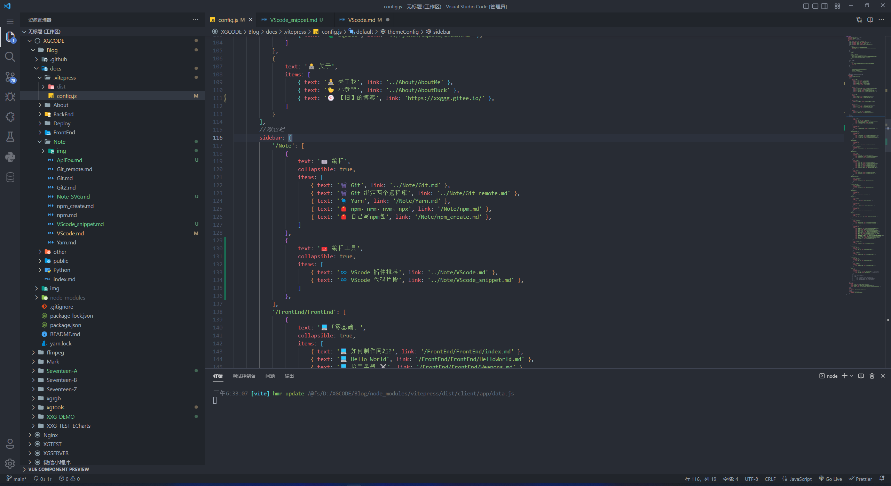
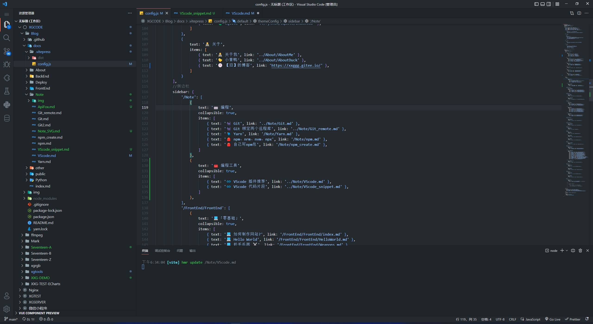
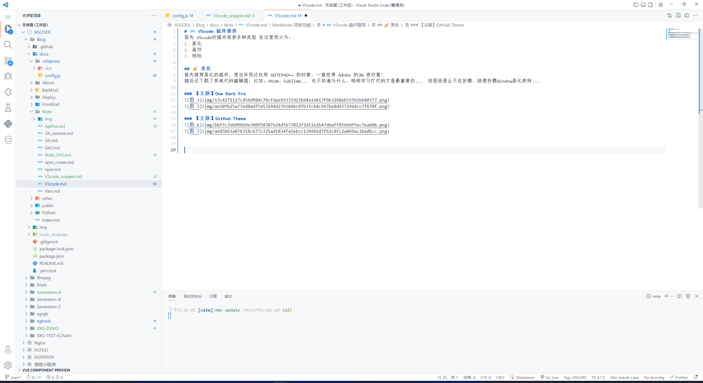
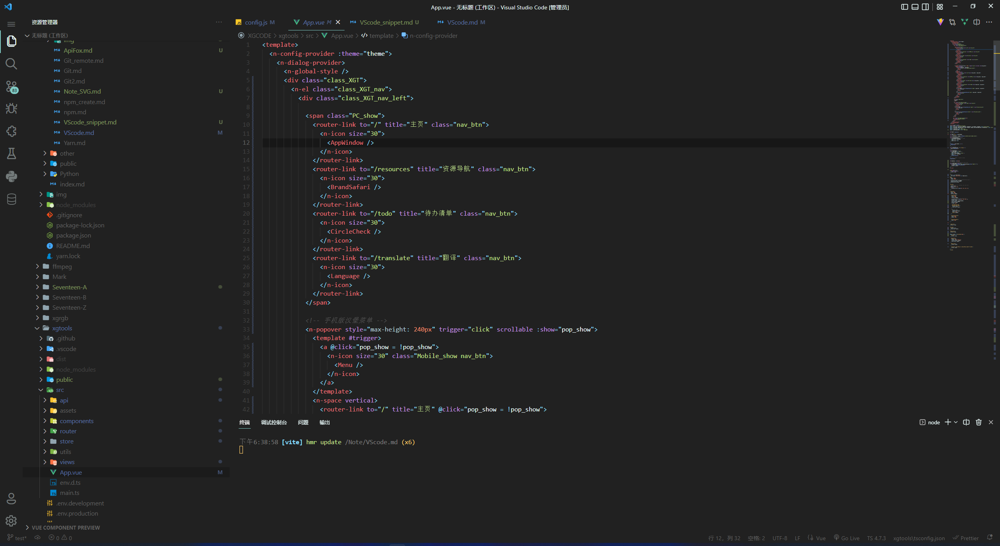
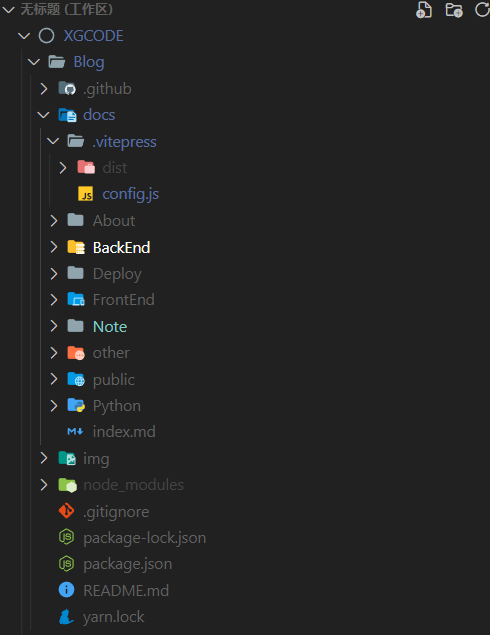
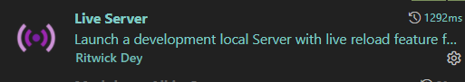
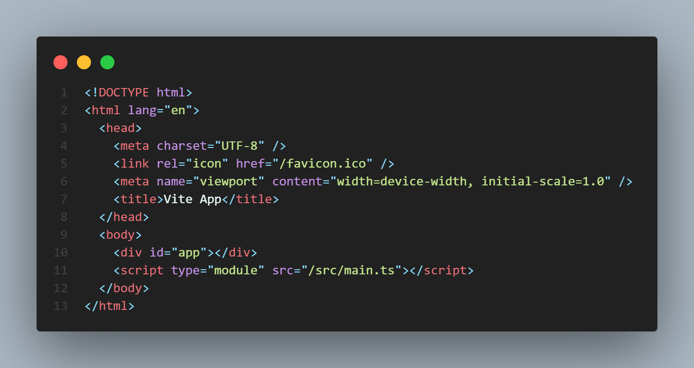

# ♾️ VScode 插件推荐
首先 VScode的插件有很多种类型 在这里我分为：
1. 💅 美化
2. 👍 高效
3. 🌟 特别  

持续更新.....
## 💅 美化
首先推荐美化的插件，想当年我还在用 NOTEPAD++ 的时候，一直觉得 Adobe 的DW 很好看！  
随后还下载了其他代码编辑器，比如：Atom、Sublime... 也不知道为什么，明明学习打代码才是最重要的...  但是就是止不住折腾，就像折腾Window美化那样...  

### 【主题】One Dark Pro   
可以说是我最喜欢的主题了~  
    
    

### 【主题】GitHub Theme
  
  
  

### 【主题】Material Theme
这个也是我当年非常喜欢的主题,现在偶尔也会换着玩玩~    
  
  

### 【文件图标】Material Theme Icons
这是我最喜欢的文件图标！所以我只推荐这个！！！   
  
  

### 【产品图标】Fluent Icons
图标 非常可爱！！！圆滑了很多~~    
同样最喜欢这个 所以只推荐这个！  
  
  

## 👍 高效

### 【标签自动补齐】Auto Renema Tage
你改HTML标签时，改前面它会帮你把后面的也一起给改了~    
  

### 【代码格式化】Prettier - Code formatter
格式化js、css  
  

### 【代码提示】IntelliCode
  

### 【小型服务器】Live Server
会把你写的html文件部署在小型服务器上，实现热更新！   
  

## 🌟 特别
### 【代码照相机】CodeSnap
可以把你的代码导出成漂亮的照片！    
  
  

