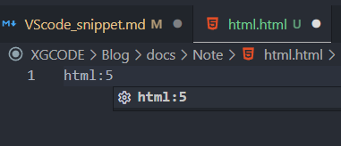
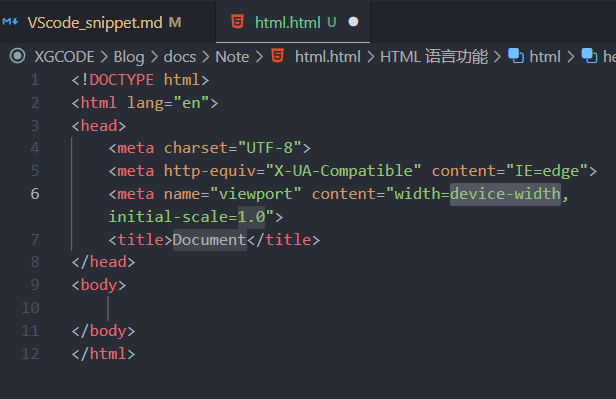
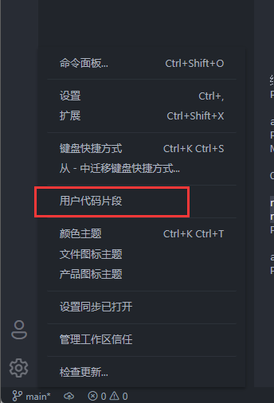
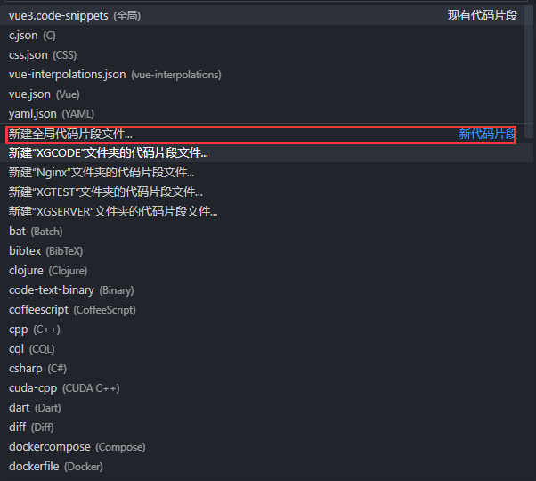

# ♾️ VScode 添加代码片段

代码片段就是字面意思，“一段代码”。一段经常使用的代码，我们给他设置一个【快捷字符】，只要下次打出这个【快捷字符】它就会变出来！

::: tip 🌰举个栗子
我们每次写HTML 都要写一大片基础的结构，而设置好了代码片段,只需要打`html:5`👇  
    
按下回车键👇 基础的代码就会出来了，再也不用一个一个打了~  
  

:::

## ⚙️ 设置方式
  

  

然后写入👇
```json
{
  "tsvue":{
    "prefix":"tsvue",
    "body":[
      "<template>",
      "  <div class=\"\"></div>",
      "</template>",
      "",
      "<script setup>",
      "import {} from 'vue'",
      "</script>",
      "",
      "<style lang='scss' scoped></style>"
    ],
    "description":"vue3"
  }
}
```
1. prefix：调起本片段的字符串
2. body： 界面显示内容，按照需求整理一个格式，新建文件的时候少改一点
3. description： 描述文字

这样我们每次在写vue组件或页面时，就可以直接写`tsvue`,节约时间，开心打代码！