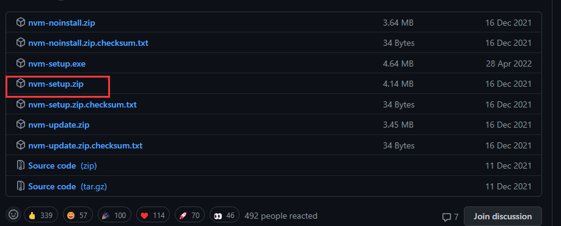

# 🎒 npm、nrm、nvm、npx

- 🎒 NPM - 包管理工具
- 🪞 NRM - 镜像源管理工具
- 🔩 NVM - 版本管理工具
- 🔧 NPX - 执行命令

## 🎒 NPM - 包管理工具
下载node.js 的时候就自带了npm

### 🛒 使用国内淘宝镜像：
当用npm去下载插件时，有可能会卡，所以可以把下载源更换为国内的淘宝镜像：
```shell
npm install -g cnpm --registry=https://registry.npm.taobao.org
```
### 🔨 安装模块
```shell
npm instll <想要安装的模块>
```
####  -g 全局
全局会安装到电脑的user目录下<br />没带g就会安装到当前文件夹里
```shell
npm instll <想要安装的模块> -g
```
#### -S 安装到生产环境
生产环境就是打包好，要发布出去时，也需要这个插件！
```shell
npm instll <想要安装的模块> -S
npm instll <想要安装的模块> --save
```
#### -D 安装到开发环境
开发环境，就是在本地开发的环境，还没打包，比如一些检查语法的插件，就只需要在开发环境中使用，在线上还检查什么语法问题....
```shell
npm instll <想要安装的模块> -D
npm instll <想要安装的模块> --dev
```
### 🗑️ 卸载模块
```shell
npm uninstll <需要卸载的模块>
npm uninstll <需要卸载的模块> -g   //带-g 卸载全局里面的
```
## 🪞 NRM - 镜像源管理工具
nrm(npm registry manager) 是npm的镜像源管理工具. 有时候国外资源太慢,使用nrm可以快速的在npm源之间切换
### 🔨 安装nrm
```shell
npm install -g nrm
```
### 👁️ 查看可选择的源
```shell
nrm ls

  npm -------- https://registry.npmjs.org/
  yarn ------- https://registry.yarnpkg.com/
  cnpm ------- http://r.cnpmjs.org/
* taobao ----- https://registry.npm.taobao.org/
  nj --------- https://registry.nodejitsu.com/
  npmMirror -- https://skimdb.npmjs.com/registry/
  edunpm ----- http://registry.enpmjs.org/
  # 其中带`*` 的就是当前使用的源. 上述适用的是淘宝的镜像源
```
### 👁️ 查看当前源
```shell
nrm current
```
### 🔃 切换镜像源
```shell
nrm use npm
```
### ➕ 添加镜像源
你可以增加定制的源，特别适用于添加企业内部的私有源，<br />执行命令:`nrm add`<br />其中reigstry为源名，url为源的路径。
```shell
nrm add registry http://registry.npm.frp.trmap.cn/
```
### 🗑️ 删除镜像源
语法: `nrm del <registry>` 删除对应的源
```shell
> nrm del taobao
# 删除淘宝的镜像源
```
### 📈 测试 源的速度
```shell
nrm test npm
```
## 🔩 NVM - 版本管理工具

nvm 用于 切换 node版本
### ⬇️ 下载nvm
> 下载地址：[https://github.com/coreybutler/nvm-windows/releases](https://github.com/coreybutler/nvm-windows/releases)  

  
### 🔨 安装nvm

先卸载原本电脑上的node，然后解压nvm-setup.zip，进入解压出来的文件夹，双击exe后缀文件进行安装，然后在命令行输入`nvm`验证安装是否成功
### 🔨 安装node
```shell
nvm install v6.9.4
```
### 👁️ 查看node版本
```shell
nvm use 6.9.4
```
### 🔧 使用或切换nodejs版本
```shell
nvm use 6.9.4
```
### 🗑️ 卸载置顶版本的node
```shell
nvm uninstall <version>
```
## 🔧 NPX - 执行命令
平时安装node模块的时候，经常使用的命令是npm。其实还有另外一个命令，叫做npx。。

- **npx侧重于执行命令的，执行某个模块命令。虽然会自动安装模块，但是重在执行某个命令。**
- **npm侧重于安装或者卸载某个模块的。重在安装，并不具备执行某个模块的功能。**
- npx非常智能的识别模块，如果模块存在，就使用。如果不存在，就临时下载，用完就删除。
- 使用某个node模块的时候，根本不用关心是否安装过了。npx会给你最满意的答案（没有对应模块就临时下载）。


