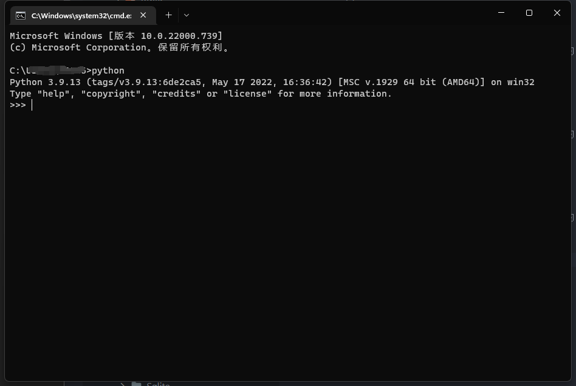

# 🐍 Python 安装

> 安装Python后，电脑会得到Python解释器

1.  安装3.x版本以上：https://www.python.org/ 
2.  配置path环境变量：在安装时把`Add Python 3.8 to PATH`勾上 
3.  安装完后，进入命令提示符敲 `python`，进入Python交互环境，检测是否安装成功

  


## 第一个程序

> 就不在命令行里敲代码了
> 直接使用 `Visual Studio Code` 来敲代码

```py
# python01.py
print('hello, world')
```
然后右键`在终端运行py文件`或者在文件的文件夹打开终端输入`python python01.py`
这样他就会输出`hello,world`，

所以`print`就是打印出来的意思
